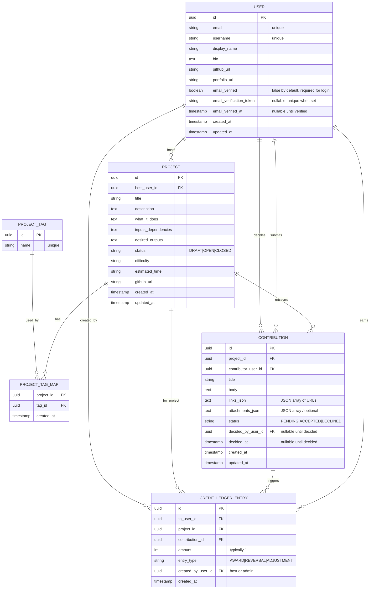

## Database (PostgreSQL)

### 1.1 Entities
- `USER`
- `PROJECT`
- `PROJECT_TAG`
- `PROJECT_TAG_MAP`
- `CONTRIBUTION`
- `CREDIT_LEDGER_ENTRY`

### 1.2 Key constraints
- User authentication:
  - `USER.email` is unique
  - **Only users with `email_verified = true` can log in**
  - `email_verification_token` must be unique when non-null
- Tags:
  - `PROJECT_TAG.name` is unique
- Tag mapping:
  - `(project_id, tag_id)` unique
- Contribution decision consistency:
  - If `status in (ACCEPTED, DECLINED)` then `decided_by_user_id` and `decided_at` are non-null
- Credit uniqueness (core business rule):
  - **At most one AWARD per (project_id, to_user_id)**

**Recommended Postgres partial unique index**
- `UNIQUE(project_id, to_user_id) WHERE entry_type = 'AWARD'`
- `UNIQUE(email_verification_token) WHERE email_verification_token IS NOT NULL`

### 1.3 Indexing
- `USER(email_verified, email_verification_token)`
- `PROJECT(host_user_id)`
- `PROJECT(status, created_at DESC)`
- `CONTRIBUTION(project_id, created_at DESC)`
- `CONTRIBUTION(contributor_user_id, created_at DESC)`
- `CREDIT_LEDGER_ENTRY(to_user_id, created_at DESC)`
- Optional search:
  - GIN full-text index over project title/description

### 1.4 Credits computation
- Total credits = count of AWARD ledger entries for a user:
  - `COUNT(*) WHERE to_user_id = ? AND entry_type='AWARD'`

### 1.5 Overall ERD

