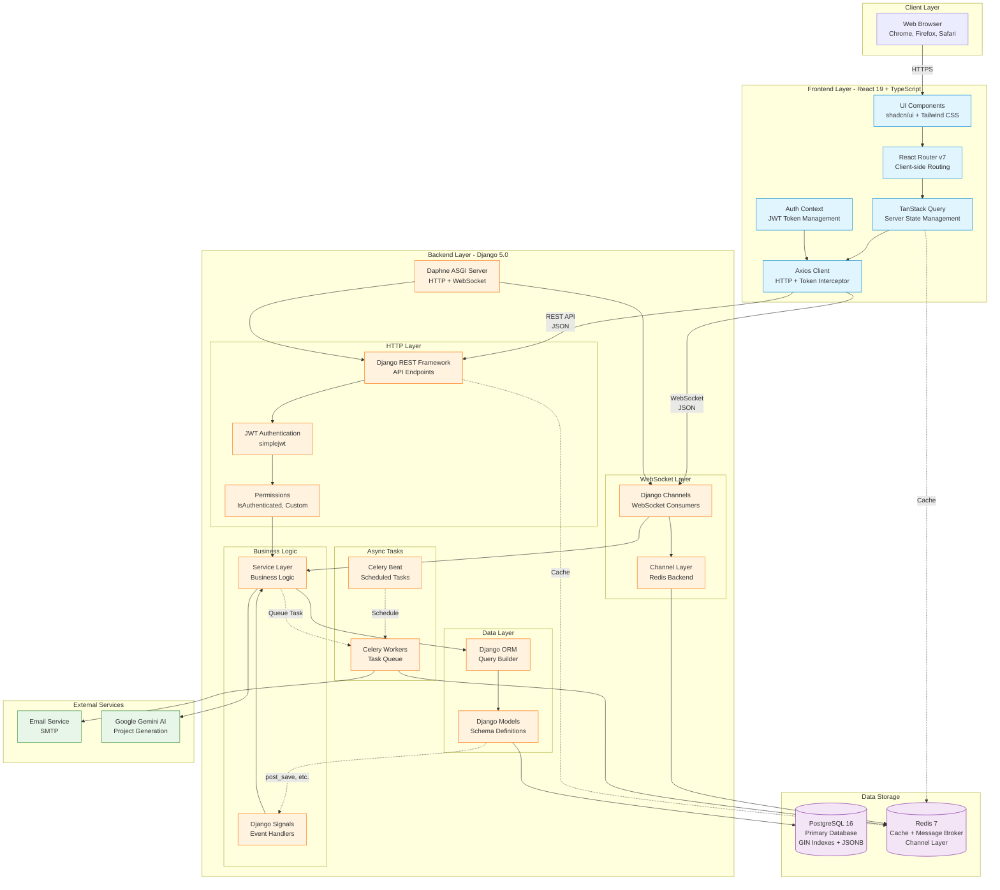
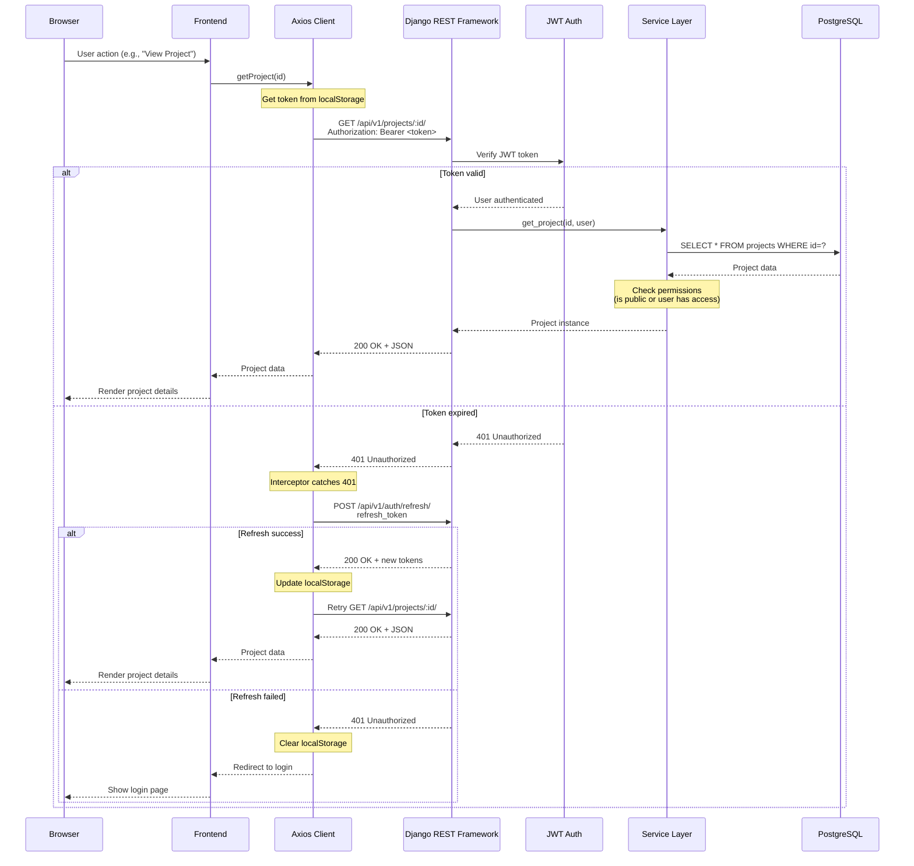
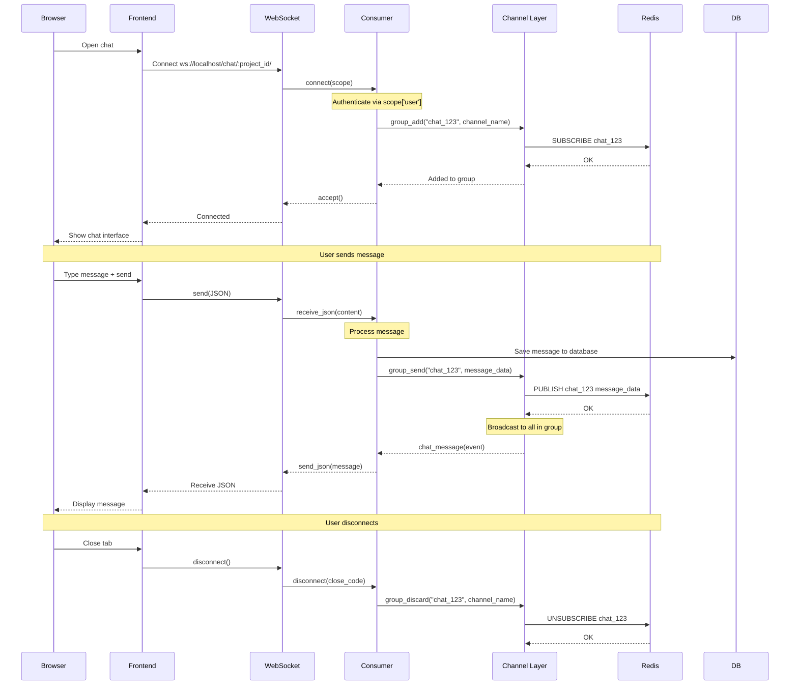
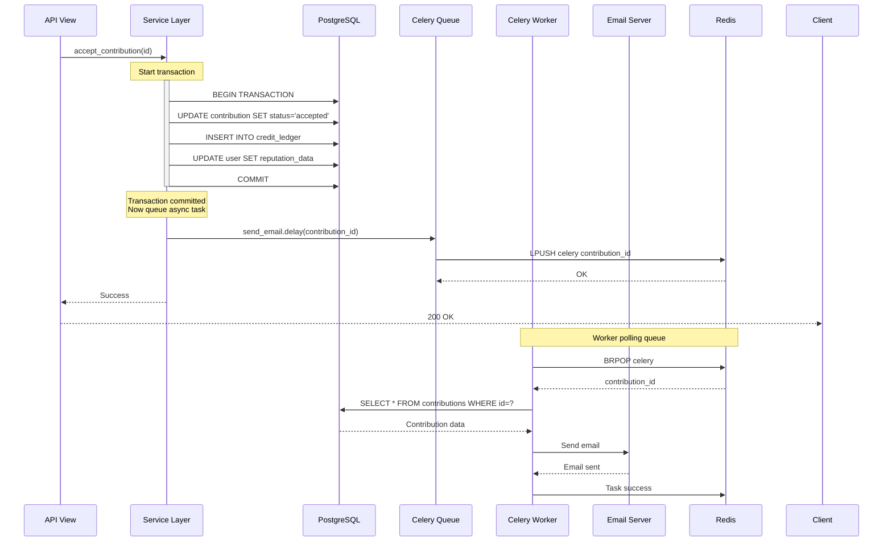

# Architecture Overview

This document provides a high-level overview of InterfaceHive's system architecture, component interactions, and data flow.

## System Architecture Diagram



## Component Layers

### 1. Client Layer

**Web Browser** - Modern browsers (Chrome, Firefox, Safari)
- Renders React application
- Executes JavaScript
- Manages localStorage (JWT tokens)
- WebSocket connections

### 2. Frontend Layer

**UI Components** (React 19 + TypeScript)
- Component-based architecture
- shadcn/ui for accessible primitives
- Tailwind CSS for styling
- Responsive design

**React Router v7** - Client-side routing
- URL-based navigation
- Code splitting
- Protected routes
- Nested layouts

**TanStack Query** - Server state management
- Automatic caching
- Background refetching
- Optimistic updates
- Request deduplication

**Auth Context** - Authentication state
- User information
- Token management
- Login/logout handlers

**Axios Client** - HTTP client
- Base URL configuration
- JWT token injection
- Automatic token refresh
- Error handling

### 3. Backend Layer

#### HTTP Layer

**Daphne** - ASGI server
- Handles both HTTP and WebSocket
- Production-ready
- Async support

**Django REST Framework** - API framework
- RESTful API endpoints
- Serialization (JSON ↔ Models)
- Content negotiation
- Browsable API (dev mode)

**JWT Authentication** - Token-based auth
- Stateless authentication
- Access token (5 min expiry)
- Refresh token (7 days)
- Automatic refresh on 401

**Permissions** - Authorization
- `IsAuthenticated` - Logged-in users only
- Custom permissions (e.g., `IsProjectHost`)
- Object-level permissions

#### WebSocket Layer

**Django Channels** - WebSocket support
- Real-time bidirectional communication
- Chat system
- Live updates

**Channel Layer** - Message routing
- Redis backend
- Group messaging
- Cross-process communication

#### Business Logic

**Service Layer** - Business logic
- Separated from views
- Reusable functions
- Transaction management
- Complex operations

**Django Signals** - Event handlers
- `post_save` - After model save
- `pre_delete` - Before model delete
- Trigger side effects (badges, notifications)

#### Data Layer

**Django ORM** - Database abstraction
- Query builder
- Lazy evaluation
- Relationships (FK, M2M)
- Aggregations

**Django Models** - Schema definitions
- Python classes → Database tables
- Field types and validation
- Constraints and indexes
- Methods and properties

#### Async Tasks

**Celery Workers** - Background tasks
- Email sending
- Notification processing
- Badge calculations
- Heavy computations

**Celery Beat** - Task scheduler
- Periodic tasks (cron-like)
- Clean up old data
- Update statistics

### 4. Data Storage

**PostgreSQL 16** - Primary database
- Relational data (users, projects, contributions)
- ACID transactions
- GIN indexes for full-text search
- JSONB for flexible data

**Redis 7** - In-memory storage
- Cache (query results, computed data)
- Celery message broker
- Channel layer backend
- Session storage

### 5. External Services

**Email Service** - SMTP
- Email verification
- Contribution notifications
- Password reset

**Google Gemini AI** - AI integration
- Project template generation
- Structured output
- Natural language processing

## Request Flow

### HTTP Request Flow



### WebSocket Connection Flow



### Async Task Flow



## Data Flow Patterns

### Read Operations

1. **Frontend** initiates request (e.g., view projects)
2. **TanStack Query** checks cache
   - If cached and fresh: Return immediately
   - If stale: Return cached + fetch in background
   - If not cached: Show loading state
3. **Axios** adds JWT token to request
4. **DRF View** receives request
5. **Authentication** verifies token
6. **Permissions** check access
7. **Service Layer** queries database
8. **ORM** generates SQL
9. **PostgreSQL** executes query
10. **Serializer** converts models to JSON
11. **Response** returned to frontend
12. **TanStack Query** caches result
13. **Component** renders data

### Write Operations

1. **Frontend** submits form
2. **Zod** validates input client-side
3. **Axios** sends POST/PUT/PATCH request
4. **DRF View** receives request
5. **Serializer** validates data
6. **Service Layer** handles business logic
7. **Transaction** begins (if multi-step)
8. **ORM** executes INSERT/UPDATE
9. **PostgreSQL** commits transaction
10. **Signals** trigger (e.g., award badge)
11. **Celery Task** queued (e.g., send email)
12. **Response** returned to frontend
13. **TanStack Query** invalidates cache
14. **Optimistic Update** (optional)
15. **Component** re-renders

## Caching Strategy

### Frontend Caching (TanStack Query)

```typescript
// Aggressive caching for static data
useQuery({
  queryKey: ['badges'],
  queryFn: getBadges,
  staleTime: Infinity,  // Never stale
  cacheTime: Infinity   // Keep forever
})

// Moderate caching for semi-static data
useQuery({
  queryKey: ['projects', 'list'],
  queryFn: getProjects,
  staleTime: 5 * 60 * 1000,   // 5 minutes
  cacheTime: 10 * 60 * 1000   // 10 minutes
})

// Minimal caching for dynamic data
useQuery({
  queryKey: ['user', 'balance'],
  queryFn: getCreditBalance,
  staleTime: 0,  // Always stale
  cacheTime: 1000  // Keep for 1 second
})
```

### Backend Caching (Redis)

```python
# View-level caching
@method_decorator(cache_page(60 * 5))  # 5 minutes
def list(self, request):
    return super().list(request)

# Query-level caching
def get_project_list():
    cache_key = 'projects:list:v1'
    result = cache.get(cache_key)

    if result is None:
        result = Project.objects.all().values()
        cache.set(cache_key, result, timeout=300)

    return result

# Invalidation on update
def update_project(project):
    project.save()
    cache.delete('projects:list:v1')  # Invalidate cache
```

## Security Layers

### Authentication

1. **JWT Tokens** - Stateless authentication
2. **Email Verification** - Prevent fake accounts
3. **Password Hashing** - bcrypt with salt
4. **Token Rotation** - Refresh tokens expire after 7 days

### Authorization

1. **Permissions** - Role-based access control
2. **Object Permissions** - Check ownership
3. **Rate Limiting** - Throttle API requests

### Data Protection

1. **HTTPS** - Encrypted communication
2. **CSRF Protection** - Token-based
3. **XSS Protection** - Content Security Policy
4. **SQL Injection** - Parameterized queries (ORM)
5. **GDPR** - Soft delete, data anonymization

## Scalability Considerations

### Horizontal Scaling

- **Frontend**: Static files on CDN
- **Backend**: Multiple Django instances behind load balancer
- **Celery**: Multiple workers
- **PostgreSQL**: Read replicas for read-heavy operations
- **Redis**: Redis Cluster for high availability

### Vertical Scaling

- **Database**: Increase RAM for better caching
- **Redis**: Increase memory for larger cache
- **Workers**: More CPU cores for Celery

### Performance Optimization

- **Database Indexes**: B-tree, GIN for search
- **Query Optimization**: select_related, prefetch_related
- **Connection Pooling**: Reuse database connections
- **Caching**: Redis for frequent queries
- **CDN**: Static assets (images, CSS, JS)
- **Code Splitting**: Load only needed JavaScript

## Monitoring and Observability

### Logging

- **Django**: Request/response logs
- **Celery**: Task execution logs
- **PostgreSQL**: Slow query log
- **Redis**: Command logs

### Metrics

- **Response Time**: API endpoint latency
- **Error Rate**: 4xx and 5xx responses
- **Database**: Query count, connection pool usage
- **Cache Hit Rate**: Redis cache effectiveness
- **Task Queue**: Celery task backlog

### Alerts

- **High Error Rate**: > 5% errors
- **Slow Responses**: > 1 second average
- **Database Connections**: > 80% pool usage
- **Disk Space**: < 20% free
- **Memory Usage**: > 90% used

## Development Workflow

1. **Local Development**: docker-compose for services
2. **Code Changes**: Hot reload (Vite HMR, Django runserver)
3. **Testing**: pytest (backend), Vitest (frontend)
4. **Code Quality**: Black, isort, ESLint, Prettier
5. **Git Workflow**: Feature branches → PR → Review → Merge
6. **CI/CD**: GitHub Actions (or similar)
7. **Deployment**: Docker containers, environment variables

## Next Steps

- [Backend Architecture](backend-architecture.md) - Django app structure in detail
- [Frontend Architecture](frontend-architecture.md) - React components and state management
- [Database Design](database-design.md) - Schema and relationships

---

This architecture provides a solid foundation for building a scalable, maintainable platform!
