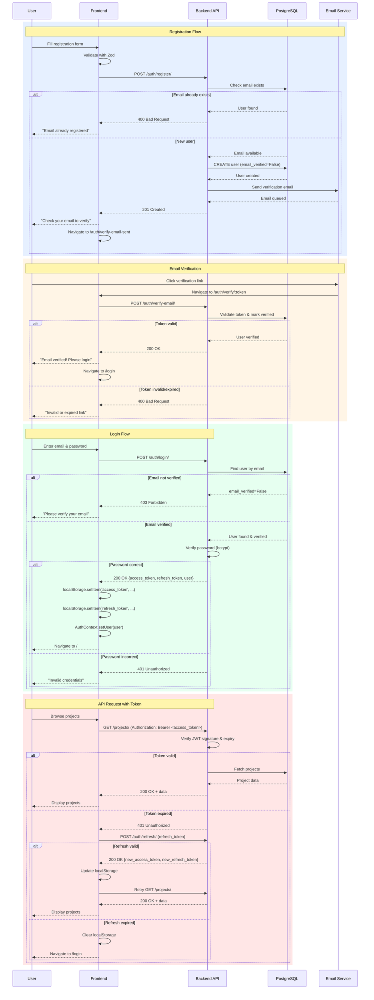

# Authentication System

InterfaceHive uses **JWT (JSON Web Tokens)** for stateless authentication with email verification requirements.

## Authentication Flow



## JWT Token Structure

### Access Token (Short-lived)

**Expiry**: 5 minutes

```json
{
  "token_type": "access",
  "exp": 1640000000,
  "iat": 1639999700,
  "jti": "abc123...",
  "user_id": "550e8400-e29b-41d4-a716-446655440000",
  "username": "contributor",
  "email": "contributor@example.com"
}
```

### Refresh Token (Long-lived)

**Expiry**: 7 days

```json
{
  "token_type": "refresh",
  "exp": 1640604800,
  "iat": 1640000000,
  "jti": "def456...",
  "user_id": "550e8400-e29b-41d4-a716-446655440000"
}
```

## Backend Implementation

### User Model

**apps/users/models.py:15-80**

```python
from django.contrib.auth.models import AbstractBaseUser, PermissionsMixin
from django.db import models
import uuid

class User(AbstractBaseUser, PermissionsMixin):
    """
    Custom user model with email as username.

    Features:
    - UUID primary key (security, scalability)
    - Email authentication (no separate username)
    - Email verification required
    - GDPR-compliant soft delete
    """
    id = models.UUIDField(primary_key=True, default=uuid.uuid4, editable=False)

    # Authentication fields
    email = models.EmailField(unique=True, db_index=True)
    password = models.CharField(max_length=128)

    # Profile fields
    display_name = models.CharField(max_length=100)
    bio = models.TextField(blank=True)
    avatar_url = models.URLField(blank=True)

    # Email verification
    email_verified = models.BooleanField(default=False)
    email_verified_at = models.DateTimeField(null=True, blank=True)
    email_verification_token = models.CharField(max_length=255, blank=True)

    # Reputation (cached from credit ledger)
    reputation_data = models.JSONField(default=dict, blank=True)

    # Permissions
    is_active = models.BooleanField(default=True)
    is_staff = models.BooleanField(default=False)
    is_superuser = models.BooleanField(default=False)

    # GDPR soft delete
    is_deleted = models.BooleanField(default=False)
    deletion_requested_at = models.DateTimeField(null=True, blank=True)
    data_anonymized_at = models.DateTimeField(null=True, blank=True)

    # Timestamps
    created_at = models.DateTimeField(auto_now_add=True)
    updated_at = models.DateTimeField(auto_now=True)

    USERNAME_FIELD = 'email'
    REQUIRED_FIELDS = ['display_name']

    objects = UserManager()

    def __str__(self):
        return self.email
```

### JWT Settings

**backend/config/settings.py**

```python
from datetime import timedelta

SIMPLE_JWT = {
    'ACCESS_TOKEN_LIFETIME': timedelta(minutes=5),
    'REFRESH_TOKEN_LIFETIME': timedelta(days=7),
    'ROTATE_REFRESH_TOKENS': True,  # Generate new refresh token on refresh
    'BLACKLIST_AFTER_ROTATION': True,  # Blacklist old refresh token
    'UPDATE_LAST_LOGIN': True,

    'ALGORITHM': 'HS256',
    'SIGNING_KEY': SECRET_KEY,
    'VERIFYING_KEY': None,

    'AUTH_HEADER_TYPES': ('Bearer',),
    'AUTH_HEADER_NAME': 'HTTP_AUTHORIZATION',

    'USER_ID_FIELD': 'id',
    'USER_ID_CLAIM': 'user_id',

    'AUTH_TOKEN_CLASSES': ('rest_framework_simplejwt.tokens.AccessToken',),
    'TOKEN_TYPE_CLAIM': 'token_type',

    'JTI_CLAIM': 'jti',  # JWT ID for blacklisting
}
```

### Authentication Views

**apps/users/views.py:20-150**

```python
from rest_framework import generics, status
from rest_framework.response import Response
from rest_framework.permissions import AllowAny
from rest_framework_simplejwt.tokens import RefreshToken
from django.contrib.auth import authenticate
from django.utils import timezone
from apps.users.models import User
from apps.users.serializers import (
    UserSerializer,
    RegisterSerializer,
    LoginSerializer
)
from apps.users.tasks import send_verification_email
import secrets


class RegisterView(generics.CreateAPIView):
    """
    Register a new user.

    POST /api/v1/auth/register/

    Request:
    {
        "email": "user@example.com",
        "password": "securepass123",
        "display_name": "John Doe"
    }

    Response: 201 Created
    {
        "message": "Registration successful. Please check your email.",
        "user": {
            "id": "...",
            "email": "user@example.com",
            "display_name": "John Doe"
        }
    }
    """
    permission_classes = [AllowAny]
    serializer_class = RegisterSerializer

    def create(self, request):
        serializer = self.get_serializer(data=request.data)
        serializer.is_valid(raise_exception=True)

        # Create user (email_verified=False)
        user = serializer.save()

        # Generate verification token
        token = secrets.token_urlsafe(32)
        user.email_verification_token = token
        user.save(update_fields=['email_verification_token'])

        # Send verification email (async)
        send_verification_email.delay(
            user_id=str(user.id),
            email=user.email,
            token=token
        )

        return Response({
            'message': 'Registration successful. Please check your email.',
            'user': UserSerializer(user).data
        }, status=status.HTTP_201_CREATED)


class VerifyEmailView(generics.GenericAPIView):
    """
    Verify email with token.

    POST /api/v1/auth/verify-email/

    Request:
    {
        "token": "verification_token_here"
    }

    Response: 200 OK
    {
        "message": "Email verified successfully"
    }
    """
    permission_classes = [AllowAny]

    def post(self, request):
        token = request.data.get('token')

        if not token:
            return Response(
                {'error': 'Token is required'},
                status=status.HTTP_400_BAD_REQUEST
            )

        try:
            user = User.objects.get(
                email_verification_token=token,
                email_verified=False
            )
        except User.DoesNotExist:
            return Response(
                {'error': 'Invalid or expired verification token'},
                status=status.HTTP_400_BAD_REQUEST
            )

        # Mark as verified
        user.email_verified = True
        user.email_verified_at = timezone.now()
        user.email_verification_token = ''  # Clear token
        user.save(update_fields=[
            'email_verified',
            'email_verified_at',
            'email_verification_token'
        ])

        return Response({
            'message': 'Email verified successfully'
        }, status=status.HTTP_200_OK)


class LoginView(generics.GenericAPIView):
    """
    Login and get JWT tokens.

    POST /api/v1/auth/login/

    Request:
    {
        "email": "user@example.com",
        "password": "securepass123"
    }

    Response: 200 OK
    {
        "access_token": "eyJ0eXAiOiJKV1QiLCJhbGc...",
        "refresh_token": "eyJ0eXAiOiJKV1QiLCJhbGc...",
        "user": {
            "id": "...",
            "email": "user@example.com",
            "display_name": "John Doe"
        }
    }
    """
    permission_classes = [AllowAny]
    serializer_class = LoginSerializer

    def post(self, request):
        serializer = self.get_serializer(data=request.data)
        serializer.is_valid(raise_exception=True)

        email = serializer.validated_data['email']
        password = serializer.validated_data['password']

        # Find user
        try:
            user = User.objects.get(email=email)
        except User.DoesNotExist:
            return Response(
                {'error': 'Invalid credentials'},
                status=status.HTTP_401_UNAUTHORIZED
            )

        # Check email verification
        if not user.email_verified:
            return Response(
                {'error': 'Please verify your email before logging in'},
                status=status.HTTP_403_FORBIDDEN
            )

        # Authenticate
        if not user.check_password(password):
            return Response(
                {'error': 'Invalid credentials'},
                status=status.HTTP_401_UNAUTHORIZED
            )

        # Generate tokens
        refresh = RefreshToken.for_user(user)
        access_token = str(refresh.access_token)
        refresh_token = str(refresh)

        return Response({
            'access_token': access_token,
            'refresh_token': refresh_token,
            'user': UserSerializer(user).data
        }, status=status.HTTP_200_OK)
```

## Frontend Implementation

### Axios Interceptor

**frontend/src/api/client.ts**

```typescript
import axios from 'axios';

const API_BASE_URL = import.meta.env.VITE_API_BASE_URL;

export const apiClient = axios.create({
  baseURL: API_BASE_URL,
  headers: {
    'Content-Type': 'application/json',
  },
});

// Request interceptor: Add token
apiClient.interceptors.request.use(
  (config) => {
    const token = localStorage.getItem('access_token');
    if (token) {
      config.headers.Authorization = `Bearer ${token}`;
    }
    return config;
  },
  (error) => Promise.reject(error)
);

// Response interceptor: Handle token refresh
apiClient.interceptors.response.use(
  (response) => response,
  async (error) => {
    const originalRequest = error.config;

    // Token expired (401) and not already retrying
    if (error.response?.status === 401 && !originalRequest._retry) {
      originalRequest._retry = true;

      const refreshToken = localStorage.getItem('refresh_token');

      if (!refreshToken) {
        // No refresh token, redirect to login
        localStorage.clear();
        window.location.href = '/login';
        return Promise.reject(error);
      }

      try {
        // Refresh tokens
        const response = await axios.post(`${API_BASE_URL}/auth/refresh/`, {
          refresh: refreshToken,
        });

        const { access, refresh: newRefresh } = response.data;

        // Update stored tokens
        localStorage.setItem('access_token', access);
        localStorage.setItem('refresh_token', newRefresh);

        // Retry original request with new token
        originalRequest.headers.Authorization = `Bearer ${access}`;
        return apiClient(originalRequest);
      } catch (refreshError) {
        // Refresh failed, redirect to login
        localStorage.clear();
        window.location.href = '/login';
        return Promise.reject(refreshError);
      }
    }

    return Promise.reject(error);
  }
);
```

### Auth Context

**frontend/src/contexts/AuthContext.tsx**

```typescript
import React, { createContext, useContext, useState, useEffect } from 'react';
import { authApi } from '@/api/auth';
import type { User } from '@/types/models';

interface AuthContextType {
  user: User | null;
  isAuthenticated: boolean;
  isLoading: boolean;
  login: (email: string, password: string) => Promise<void>;
  register: (data: RegisterData) => Promise<void>;
  logout: () => void;
}

const AuthContext = createContext<AuthContextType | null>(null);

export function AuthProvider({ children }: { children: React.ReactNode }) {
  const [user, setUser] = useState<User | null>(null);
  const [isLoading, setIsLoading] = useState(true);

  // Load user from token on mount
  useEffect(() => {
    const token = localStorage.getItem('access_token');
    if (token) {
      // Fetch current user
      authApi.me()
        .then(setUser)
        .catch(() => {
          localStorage.clear();
        })
        .finally(() => setIsLoading(false));
    } else {
      setIsLoading(false);
    }
  }, []);

  const login = async (email: string, password: string) => {
    const response = await authApi.login({ email, password });

    // Store tokens
    localStorage.setItem('access_token', response.access_token);
    localStorage.setItem('refresh_token', response.refresh_token);

    // Set user
    setUser(response.user);
  };

  const register = async (data: RegisterData) => {
    await authApi.register(data);
    // Don't log in automatically - require email verification
  };

  const logout = () => {
    localStorage.clear();
    setUser(null);
    window.location.href = '/login';
  };

  return (
    <AuthContext.Provider
      value={{
        user,
        isAuthenticated: !!user,
        isLoading,
        login,
        register,
        logout,
      }}
    >
      {children}
    </AuthContext.Provider>
  );
}

export const useAuth = () => {
  const context = useContext(AuthContext);
  if (!context) {
    throw new Error('useAuth must be used within AuthProvider');
  }
  return context;
};
```

## Security Considerations

### 1. Password Hashing

Django uses **bcrypt** by default:

```python
from django.contrib.auth.hashers import make_password, check_password

# Registration
user.password = make_password(raw_password)

# Login
if check_password(raw_password, user.password):
    # Valid
```

### 2. Token Storage

**Frontend**: localStorage (XSS risk mitigation)
- Don't use `eval()` or `dangerouslySetInnerHTML`
- Sanitize user input
- Use Content Security Policy (CSP)

**Alternative**: httpOnly cookies (CSRF risk)

### 3. Token Expiry

- **Access token**: Short (5 min) → Limits damage if stolen
- **Refresh token**: Long (7 days) → Better UX
- **Rotation**: New refresh token on each refresh → Invalidates old ones

### 4. Email Verification

Prevents:
- Fake accounts
- Email spam
- Unauthorized access

### 5. HTTPS Only

All production traffic must use HTTPS:
- Prevents token interception
- Protects password transmission

## Edge Cases

### 1. Concurrent Login

**Problem**: User logs in from multiple devices.

**Solution**: Allow multiple sessions (each has own refresh token)

### 2. Token Refresh Race Condition

**Problem**: Multiple requests trigger token refresh simultaneously.

**Solution**: Queue requests during refresh

```typescript
let isRefreshing = false;
let failedQueue: any[] = [];

// In interceptor
if (!isRefreshing) {
  isRefreshing = true;
  // Refresh...
  isRefreshing = false;
  // Process queue
} else {
  // Add to queue
  failedQueue.push(originalRequest);
}
```

### 3. Logout on All Devices

**Problem**: User wants to logout everywhere.

**Solution**: Token blacklisting (requires backend state)

```python
# Enable blacklisting
SIMPLE_JWT = {
    'BLACKLIST_AFTER_ROTATION': True,
}

# Install app
INSTALLED_APPS += ['rest_framework_simplejwt.token_blacklist']

# Logout endpoint
class LogoutView(APIView):
    def post(self, request):
        try:
            refresh_token = request.data['refresh_token']
            token = RefreshToken(refresh_token)
            token.blacklist()  # Add to blacklist
            return Response(status=status.HTTP_205_RESET_CONTENT)
        except Exception:
            return Response(status=status.HTTP_400_BAD_REQUEST)
```

## Testing

### Backend Tests

```python
@pytest.mark.django_db
def test_login_requires_email_verification(client):
    """Test that unverified users cannot login"""
    user = User.objects.create_user(
        email='test@example.com',
        password='testpass123',
        email_verified=False  # Not verified
    )

    response = client.post('/api/v1/auth/login/', {
        'email': 'test@example.com',
        'password': 'testpass123'
    })

    assert response.status_code == 403
    assert 'verify your email' in response.data['error'].lower()


@pytest.mark.django_db
def test_access_token_expires(client, verified_user):
    """Test that expired tokens are rejected"""
    # Login
    response = client.post('/api/v1/auth/login/', {
        'email': verified_user.email,
        'password': 'testpass123'
    })
    access_token = response.data['access_token']

    # Use token
    client.credentials(HTTP_AUTHORIZATION=f'Bearer {access_token}')
    response = client.get('/api/v1/projects/')
    assert response.status_code == 200

    # Wait for expiry (or mock time)
    time.sleep(301)  # 5 min + 1 sec

    # Should be rejected
    response = client.get('/api/v1/projects/')
    assert response.status_code == 401
```

## Best Practices

1. **Never store passwords in plain text**
2. **Always verify email** before allowing full access
3. **Use HTTPS** in production
4. **Implement rate limiting** on login/register endpoints
5. **Log authentication events** for security audits
6. **Rotate refresh tokens** to invalidate old ones
7. **Clear tokens on logout** (client-side)

## Next Steps

- [Project Management](project-management.md) - Authenticated features
- [Contribution Workflow](contribution-workflow.md) - Requires authentication
- [Security Best Practices](../06-best-practices/security.md) - Complete security guide

---

Secure authentication is the foundation of a trusted platform!
