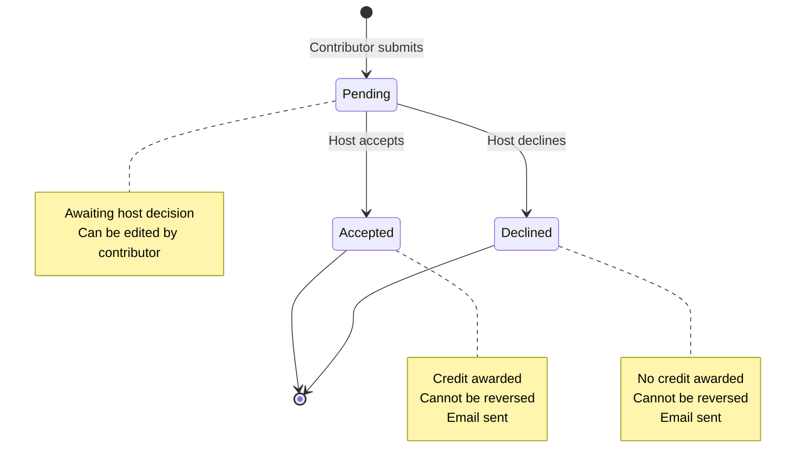
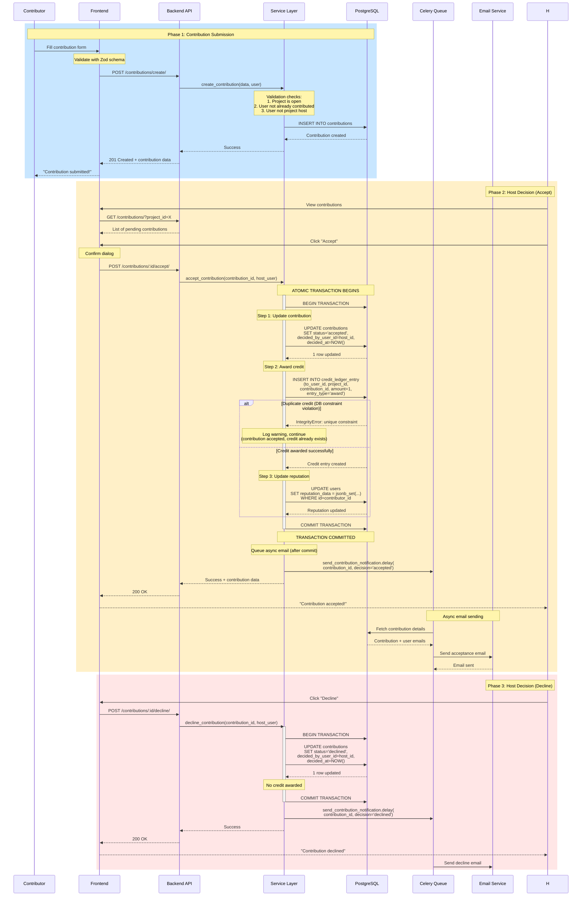

# Contribution Workflow

The contribution workflow is the core feature of InterfaceHive, enabling contributors to submit work and hosts to review and accept/decline contributions. This document explains the complete workflow, implementation details, and edge cases.

## Overview

The contribution system implements a **state machine** with atomic transitions that ensure data integrity through database-level constraints and Django transactions.

### State Machine



## Complete Workflow Sequence



## Backend Implementation

### Models

**apps/contributions/models.py:15-56**

```python
from django.db import models
from django.core.exceptions import ValidationError
import uuid

class Contribution(models.Model):
    """
    Represents a contribution submission to a project.

    State Machine:
    - pending: Awaiting host decision (initial state)
    - accepted: Host approved (final state, credit awarded)
    - declined: Host rejected (final state, no credit)

    Constraints:
    - One contribution per user per project (enforced by DB constraint)
    - Only project host can accept/decline
    - Status cannot be changed once accepted/declined
    """
    STATUS_CHOICES = [
        ('pending', 'Pending'),
        ('accepted', 'Accepted'),
        ('declined', 'Declined'),
    ]

    id = models.UUIDField(primary_key=True, default=uuid.uuid4, editable=False)

    # Relationships
    project = models.ForeignKey(
        'projects.Project',
        on_delete=models.CASCADE,
        related_name='contributions'
    )
    contributor_user = models.ForeignKey(
        'users.User',
        on_delete=models.CASCADE,
        related_name='contributions'
    )
    decided_by_user = models.ForeignKey(
        'users.User',
        on_delete=models.SET_NULL,
        null=True,
        blank=True,
        related_name='decided_contributions'
    )

    # Content
    body = models.TextField(help_text="Description of the contribution")
    links_json = models.JSONField(
        default=list,
        help_text="List of URLs (GitHub, CodePen, etc.)"
    )
    attachments_json = models.JSONField(
        default=list,
        help_text="List of file attachments"
    )

    # State
    status = models.CharField(
        max_length=20,
        choices=STATUS_CHOICES,
        default='pending'
    )

    # Timestamps
    created_at = models.DateTimeField(auto_now_add=True)
    updated_at = models.DateTimeField(auto_now=True)
    decided_at = models.DateTimeField(null=True, blank=True)

    class Meta:
        db_table = 'contributions_contribution'
        ordering = ['-created_at']
        indexes = [
            models.Index(fields=['project', 'status']),
            models.Index(fields=['contributor_user', 'status']),
        ]
        constraints = [
            # Prevent duplicate contributions
            models.UniqueConstraint(
                fields=['project', 'contributor_user'],
                name='unique_contribution_per_project_per_user'
            ),
            # Prevent host from contributing to own project
            models.CheckConstraint(
                check=~models.Q(contributor_user=models.F('project__host_user')),
                name='contributor_not_host'
            )
        ]

    def clean(self):
        """Model-level validation"""
        if self.contributor_user == self.project.host_user:
            raise ValidationError("Project host cannot contribute to their own project")

        if self.project.status != 'open':
            raise ValidationError(f"Cannot contribute to {self.project.status} project")

    def save(self, *args, **kwargs):
        self.full_clean()  # Run validation
        super().save(*args, **kwargs)

    def __str__(self):
        return f"Contribution by {self.contributor_user.display_name} to {self.project.title}"
```

### Service Layer

**apps/contributions/services.py:10-85**

```python
from django.db import transaction
from django.utils import timezone
from django.core.exceptions import ValidationError
from apps.credits.services import CreditService
from apps.contributions.models import Contribution
from apps.contributions.tasks import send_contribution_notification
import logging

logger = logging.getLogger(__name__)


@transaction.atomic
def accept_contribution(contribution: Contribution, decided_by_user) -> dict:
    """
    Accept a contribution and award credit atomically.

    This function ensures ACID properties:
    - Atomicity: All operations succeed or all fail
    - Consistency: Database constraints maintained
    - Isolation: Other transactions don't see partial state
    - Durability: Committed changes persist

    Process:
    1. Validate state and permissions
    2. Update contribution status
    3. Award credit to contributor
    4. Update contributor reputation
    5. Queue notification email (after commit)

    Args:
        contribution: Contribution instance to accept
        decided_by_user: User making the decision (must be project host)

    Returns:
        dict: {
            'contribution': Updated contribution instance,
            'credit_entry': CreditLedgerEntry or None (if duplicate)
        }

    Raises:
        ValueError: If contribution is not pending
        PermissionError: If decided_by_user is not project host

    Edge Cases Handled:
    - Duplicate credit award: Logged, contribution still accepted
    - Race condition: Transaction isolation prevents double accept
    - Email failure: Queued after commit, won't rollback transaction
    """
    # Validation
    if contribution.status != 'pending':
        raise ValueError(
            f"Cannot accept contribution with status '{contribution.status}'"
        )

    if contribution.project.host_user != decided_by_user:
        raise PermissionError(
            "Only the project host can accept contributions"
        )

    # Step 1: Update contribution status
    contribution.status = 'accepted'
    contribution.decided_by_user = decided_by_user
    contribution.decided_at = timezone.now()
    contribution.save(update_fields=['status', 'decided_by_user', 'decided_at'])

    logger.info(
        f"Contribution {contribution.id} accepted by {decided_by_user.username}"
    )

    # Step 2: Award credit (in same transaction)
    credit_entry = None
    try:
        credit_entry = CreditService.award_credit(
            to_user=contribution.contributor_user,
            project=contribution.project,
            contribution=contribution,
            created_by_user=decided_by_user,
            amount=1
        )
        logger.info(
            f"Credit awarded to {contribution.contributor_user.username} "
            f"for contribution {contribution.id}"
        )
    except IntegrityError as e:
        # Credit already awarded (duplicate prevention)
        logger.warning(
            f"Credit already exists for contribution {contribution.id}: {e}"
        )
        # Don't raise - contribution is accepted, credit just already exists

    # Step 3: Queue notification (after transaction commits)
    transaction.on_commit(
        lambda: send_contribution_notification.delay(
            contribution_id=str(contribution.id),
            decision='accepted'
        )
    )

    return {
        'contribution': contribution,
        'credit_entry': credit_entry
    }


@transaction.atomic
def decline_contribution(contribution: Contribution, decided_by_user) -> dict:
    """
    Decline a contribution (no credit awarded).

    Args:
        contribution: Contribution instance to decline
        decided_by_user: User making the decision (must be project host)

    Returns:
        dict: {'contribution': Updated contribution instance}

    Raises:
        ValueError: If contribution is not pending
        PermissionError: If decided_by_user is not project host
    """
    # Validation
    if contribution.status != 'pending':
        raise ValueError(
            f"Cannot decline contribution with status '{contribution.status}'"
        )

    if contribution.project.host_user != decided_by_user:
        raise PermissionError(
            "Only the project host can decline contributions"
        )

    # Update contribution status (no credit)
    contribution.status = 'declined'
    contribution.decided_by_user = decided_by_user
    contribution.decided_at = timezone.now()
    contribution.save(update_fields=['status', 'decided_by_user', 'decided_at'])

    logger.info(
        f"Contribution {contribution.id} declined by {decided_by_user.username}"
    )

    # Queue notification
    transaction.on_commit(
        lambda: send_contribution_notification.delay(
            contribution_id=str(contribution.id),
            decision='declined'
        )
    )

    return {'contribution': contribution}
```

### API Views

**apps/contributions/views.py:50-120**

```python
from rest_framework import generics, status
from rest_framework.permissions import IsAuthenticated
from rest_framework.response import Response
from rest_framework.exceptions import ValidationError, PermissionDenied
from apps.contributions.models import Contribution
from apps.contributions.serializers import ContributionSerializer
from apps.contributions.services import accept_contribution, decline_contribution


class AcceptContributionView(generics.GenericAPIView):
    """
    Accept a contribution.

    POST /api/v1/contributions/:id/accept/

    Requires:
    - Authentication: User must be logged in
    - Permission: User must be project host

    Returns:
    - 200 OK: Contribution accepted
    - 400 Bad Request: Invalid state
    - 403 Forbidden: Not project host
    - 404 Not Found: Contribution doesn't exist
    """
    permission_classes = [IsAuthenticated]
    serializer_class = ContributionSerializer

    def post(self, request, pk):
        try:
            contribution = Contribution.objects.select_related(
                'project',
                'contributor_user',
                'project__host_user'
            ).get(pk=pk)
        except Contribution.DoesNotExist:
            return Response(
                {'error': 'Contribution not found'},
                status=status.HTTP_404_NOT_FOUND
            )

        try:
            result = accept_contribution(contribution, request.user)

            return Response({
                'message': 'Contribution accepted successfully',
                'contribution': ContributionSerializer(result['contribution']).data,
                'credit_awarded': result['credit_entry'] is not None
            }, status=status.HTTP_200_OK)

        except ValueError as e:
            # Invalid state (e.g., already accepted/declined)
            return Response(
                {'error': str(e)},
                status=status.HTTP_400_BAD_REQUEST
            )

        except PermissionError as e:
            # Not project host
            return Response(
                {'error': str(e)},
                status=status.HTTP_403_FORBIDDEN
            )


class DeclineContributionView(generics.GenericAPIView):
    """
    Decline a contribution.

    POST /api/v1/contributions/:id/decline/

    Requires:
    - Authentication: User must be logged in
    - Permission: User must be project host

    Returns:
    - 200 OK: Contribution declined
    - 400 Bad Request: Invalid state
    - 403 Forbidden: Not project host
    - 404 Not Found: Contribution doesn't exist
    """
    permission_classes = [IsAuthenticated]
    serializer_class = ContributionSerializer

    def post(self, request, pk):
        try:
            contribution = Contribution.objects.select_related(
                'project',
                'contributor_user',
                'project__host_user'
            ).get(pk=pk)
        except Contribution.DoesNotExist:
            return Response(
                {'error': 'Contribution not found'},
                status=status.HTTP_404_NOT_FOUND
            )

        try:
            result = decline_contribution(contribution, request.user)

            return Response({
                'message': 'Contribution declined',
                'contribution': ContributionSerializer(result['contribution']).data
            }, status=status.HTTP_200_OK)

        except ValueError as e:
            return Response(
                {'error': str(e)},
                status=status.HTTP_400_BAD_REQUEST
            )

        except PermissionError as e:
            return Response(
                {'error': str(e)},
                status=status.HTTP_403_FORBIDDEN
            )
```

### Celery Tasks

**apps/contributions/tasks.py:5-45**

```python
from celery import shared_task
from django.core.mail import send_mail
from django.conf import settings
from apps.contributions.models import Contribution
import logging

logger = logging.getLogger(__name__)


@shared_task(
    bind=True,
    autoretry_for=(Exception,),
    retry_kwargs={'max_retries': 3, 'countdown': 60},
    retry_backoff=True
)
def send_contribution_notification(self, contribution_id: str, decision: str):
    """
    Send email notification about contribution decision.

    This task retries automatically on failure with exponential backoff.

    Args:
        contribution_id: UUID of contribution
        decision: 'accepted' or 'declined'

    Retry Strategy:
    - Max retries: 3
    - Initial delay: 60 seconds
    - Exponential backoff: 60s, 120s, 240s
    """
    try:
        contribution = Contribution.objects.select_related(
            'project',
            'contributor_user',
            'project__host_user'
        ).get(id=contribution_id)

        subject = f"Your contribution has been {decision}"
        message = f"""
        Hi {contribution.contributor_user.display_name},

        Your contribution to "{contribution.project.title}" has been {decision}.

        Project: {contribution.project.title}
        Decision by: {contribution.project.host_user.display_name}
        Date: {contribution.decided_at.strftime('%Y-%m-%d %H:%M')}

        {'You have been awarded 1 credit!' if decision == 'accepted' else 'Better luck next time!'}

        View your contributions: {settings.FRONTEND_URL}/my-contributions

        Best regards,
        InterfaceHive Team
        """

        send_mail(
            subject=subject,
            message=message,
            from_email=settings.DEFAULT_FROM_EMAIL,
            recipient_list=[contribution.contributor_user.email],
            fail_silently=False
        )

        logger.info(
            f"Notification sent for contribution {contribution_id} ({decision})"
        )

    except Contribution.DoesNotExist:
        logger.error(f"Contribution {contribution_id} not found")
        # Don't retry if contribution doesn't exist
        raise self.retry(exc=Exception("Contribution not found"), countdown=0)

    except Exception as e:
        logger.error(
            f"Failed to send notification for {contribution_id}: {e}",
            exc_info=True
        )
        raise  # Will trigger automatic retry
```

## Frontend Implementation

### API Client

**frontend/src/api/contributions.ts**

```typescript
import { apiClient } from './client';
import type { Contribution, ContributionCreate } from '@/types/models';

export const contributionsApi = {
  // List contributions (with optional filters)
  list: async (params?: {
    project_id?: string;
    contributor_user_id?: string;
    status?: 'pending' | 'accepted' | 'declined';
  }) => {
    const response = await apiClient.get<{ results: Contribution[] }>(
      '/contributions/',
      { params }
    );
    return response.data.results;
  },

  // Get single contribution
  get: async (id: string) => {
    const response = await apiClient.get<Contribution>(`/contributions/${id}/`);
    return response.data;
  },

  // Submit contribution
  create: async (data: ContributionCreate) => {
    const response = await apiClient.post<Contribution>(
      '/contributions/create/',
      data
    );
    return response.data;
  },

  // Accept contribution (host only)
  accept: async (id: string) => {
    const response = await apiClient.post<{
      message: string;
      contribution: Contribution;
      credit_awarded: boolean;
    }>(`/contributions/${id}/accept/`);
    return response.data;
  },

  // Decline contribution (host only)
  decline: async (id: string) => {
    const response = await apiClient.post<{
      message: string;
      contribution: Contribution;
    }>(`/contributions/${id}/decline/`);
    return response.data;
  },
};
```

### React Hook

**frontend/src/hooks/useContributions.ts**

```typescript
import { useMutation, useQuery, useQueryClient } from '@tanstack/react-query';
import { contributionsApi } from '@/api/contributions';
import { toast } from '@/components/ui/use-toast';

export function useAcceptContribution() {
  const queryClient = useQueryClient();

  return useMutation({
    mutationFn: (contributionId: string) => contributionsApi.accept(contributionId),

    // Optimistic update
    onMutate: async (contributionId) => {
      // Cancel outgoing queries
      await queryClient.cancelQueries({ queryKey: ['contributions'] });

      // Snapshot previous value
      const previousContributions = queryClient.getQueryData([
        'contributions',
        contributionId,
      ]);

      // Optimistically update UI
      queryClient.setQueryData(['contributions', contributionId], (old: any) => ({
        ...old,
        status: 'accepted',
        decided_at: new Date().toISOString(),
      }));

      return { previousContributions };
    },

    // Rollback on error
    onError: (error, contributionId, context) => {
      queryClient.setQueryData(
        ['contributions', contributionId],
        context?.previousContributions
      );

      toast({
        title: 'Error',
        description: error.message || 'Failed to accept contribution',
        variant: 'destructive',
      });
    },

    // Success handler
    onSuccess: (data) => {
      toast({
        title: 'Success',
        description: data.message,
      });

      // Invalidate related queries
      queryClient.invalidateQueries({ queryKey: ['contributions'] });
      queryClient.invalidateQueries({ queryKey: ['projects'] });
      queryClient.invalidateQueries({ queryKey: ['credits'] });
    },
  });
}

export function useDeclineContribution() {
  const queryClient = useQueryClient();

  return useMutation({
    mutationFn: (contributionId: string) => contributionsApi.decline(contributionId),

    onSuccess: (data) => {
      toast({
        title: 'Contribution Declined',
        description: data.message,
      });

      queryClient.invalidateQueries({ queryKey: ['contributions'] });
      queryClient.invalidateQueries({ queryKey: ['projects'] });
    },

    onError: (error) => {
      toast({
        title: 'Error',
        description: error.message || 'Failed to decline contribution',
        variant: 'destructive',
      });
    },
  });
}
```

## Edge Cases and Solutions

### 1. Duplicate Contribution Prevention

**Problem**: User tries to submit multiple contributions to same project.

**Solution**: Database unique constraint + API validation

```python
# Database constraint in models.py
models.UniqueConstraint(
    fields=['project', 'contributor_user'],
    name='unique_contribution_per_project_per_user'
)

# API validation in views.py
if Contribution.objects.filter(
    project=project,
    contributor_user=request.user
).exists():
    raise ValidationError("You have already contributed to this project")
```

### 2. Race Condition on Accept

**Problem**: Two hosts (edge case) or double-click tries to accept twice.

**Solution**: Transaction isolation + status check

```python
@transaction.atomic
def accept_contribution(contribution, decided_by_user):
    # Re-fetch within transaction to get latest state
    contribution = Contribution.objects.select_for_update().get(id=contribution.id)

    if contribution.status != 'pending':
        raise ValueError("Already processed")

    # Proceed with acceptance...
```

### 3. Duplicate Credit Award

**Problem**: Credit awarded multiple times due to retry or bug.

**Solution**: Unique constraint in credit ledger

```python
# In CreditLedgerEntry model
class Meta:
    constraints = [
        models.UniqueConstraint(
            fields=['contribution'],
            condition=models.Q(entry_type='award'),
            name='unique_credit_per_contribution'
        )
    ]
```

### 4. Email Sending Failure

**Problem**: Email service down, transaction should still commit.

**Solution**: Queue email after transaction commit

```python
@transaction.atomic
def accept_contribution(...):
    # ... database operations ...

    # Queue email AFTER commit
    transaction.on_commit(
        lambda: send_notification.delay(contribution_id)
    )
```

### 5. Contributor is Project Host

**Problem**: Host tries to contribute to own project.

**Solution**: Database check constraint + validation

```python
# Database constraint
models.CheckConstraint(
    check=~models.Q(contributor_user=models.F('project__host_user')),
    name='contributor_not_host'
)

# Model validation
def clean(self):
    if self.contributor_user == self.project.host_user:
        raise ValidationError("Host cannot contribute to own project")
```

### 6. Project Closed After Contribution

**Problem**: Project closed while contributions pending.

**Solution**: Allow contributions to closed projects, but disallow new ones

```python
# In contribution create view
if project.status != 'open':
    raise ValidationError("Project is not accepting contributions")

# Existing pending contributions remain valid
```

### 7. Optimistic Update Rollback

**Problem**: UI shows accepted, but API fails.

**Solution**: TanStack Query rollback on error

```typescript
onError: (error, contributionId, context) => {
  // Restore previous state
  queryClient.setQueryData(
    ['contributions', contributionId],
    context?.previousContributions
  );

  // Show error to user
  toast({ title: 'Error', description: error.message });
};
```

## Testing

### Backend Tests

```python
# apps/contributions/tests/test_services.py
import pytest
from django.db import transaction
from apps.contributions.services import accept_contribution
from apps.contributions.models import Contribution
from apps.credits.models import CreditLedgerEntry

@pytest.mark.django_db
def test_accept_contribution_awards_credit(project, contributor_user, host_user):
    """Test that accepting contribution awards credit atomically"""
    # Create pending contribution
    contribution = Contribution.objects.create(
        project=project,
        contributor_user=contributor_user,
        body="Test contribution",
        status='pending'
    )

    # Accept contribution
    result = accept_contribution(contribution, host_user)

    # Verify contribution status
    assert result['contribution'].status == 'accepted'
    assert result['contribution'].decided_by_user == host_user

    # Verify credit awarded
    assert result['credit_entry'] is not None
    assert CreditLedgerEntry.objects.filter(
        contribution=contribution,
        to_user=contributor_user,
        amount=1
    ).exists()


@pytest.mark.django_db
def test_cannot_accept_twice(project, contributor_user, host_user):
    """Test that accepting twice raises error"""
    contribution = Contribution.objects.create(
        project=project,
        contributor_user=contributor_user,
        body="Test",
        status='pending'
    )

    # First accept
    accept_contribution(contribution, host_user)

    # Second accept should fail
    with pytest.raises(ValueError, match="Cannot accept"):
        accept_contribution(contribution, host_user)


@pytest.mark.django_db
def test_transaction_rollback_on_error(project, contributor_user, host_user, monkeypatch):
    """Test that transaction rolls back if credit award fails"""
    contribution = Contribution.objects.create(
        project=project,
        contributor_user=contributor_user,
        body="Test",
        status='pending'
    )

    # Mock credit service to raise error
    def mock_award_credit(*args, **kwargs):
        raise Exception("Credit service failed")

    monkeypatch.setattr('apps.credits.services.award_credit', mock_award_credit)

    # Accept should fail completely
    with pytest.raises(Exception):
        accept_contribution(contribution, host_user)

    # Contribution should still be pending (transaction rolled back)
    contribution.refresh_from_db()
    assert contribution.status == 'pending'
```

## Performance Considerations

### Query Optimization

```python
# ❌ Bad: N+1 queries
contributions = Contribution.objects.all()
for c in contributions:
    print(c.project.title)  # Query per contribution!
    print(c.contributor_user.display_name)  # Another query!

# ✅ Good: Single query with JOINs
contributions = Contribution.objects.select_related(
    'project',
    'contributor_user',
    'decided_by_user'
).all()
for c in contributions:
    print(c.project.title)  # No extra query
    print(c.contributor_user.display_name)  # No extra query
```

### Database Indexes

```python
class Meta:
    indexes = [
        models.Index(fields=['project', 'status']),  # Filter by project + status
        models.Index(fields=['contributor_user', 'status']),  # User's contributions
        models.Index(fields=['decided_at']),  # Sort by decision date
    ]
```

## Monitoring and Debugging

### Logging

```python
import logging

logger = logging.getLogger(__name__)

logger.info(f"Contribution {contribution.id} accepted by {user.username}")
logger.warning(f"Duplicate credit for contribution {contribution.id}")
logger.error(f"Failed to send email: {error}", exc_info=True)
```

### Metrics to Track

- **Acceptance Rate**: % contributions accepted
- **Response Time**: Time from submission to decision
- **Credit Awards**: Total credits distributed
- **Email Delivery**: Success rate of notifications

## Best Practices

1. **Always use transactions** for multi-step operations
2. **Validate state** before state transitions
3. **Use database constraints** to prevent invalid data
4. **Queue async tasks** after transaction commit
5. **Handle edge cases** explicitly
6. **Log important events** for debugging
7. **Test rollback scenarios** thoroughly

## Next Steps

- [Credit System](credit-system.md) - How credits are awarded and tracked
- [Atomic Transactions](../04-advanced-topics/atomic-transactions.md) - Deep dive into ACID properties
- [Performance Optimization](../04-advanced-topics/performance-optimization.md) - Query optimization

---

The contribution workflow is the heart of InterfaceHive. Understanding this flow is essential for maintaining and extending the platform!
