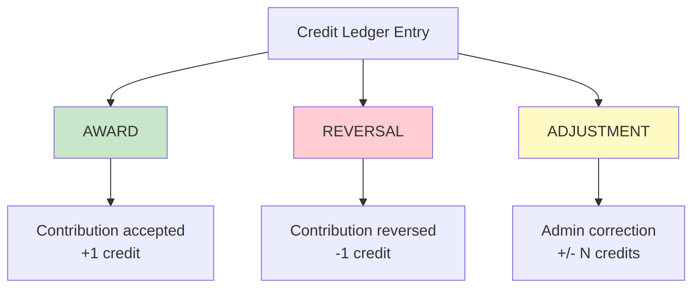

# Credit System

The credit system is InterfaceHive's **immutable ledger** that tracks all credit awards, reversals, and adjustments. It powers the reputation system and ensures transparency and auditability.

## Core Concepts

### Immutable Ledger

The credit ledger is **append-only** - entries are never updated or deleted. This design:
- Provides complete audit trail
- Prevents credit manipulation
- Enables historical analysis
- Simplifies debugging

### Entry Types



## Database Schema

### CreditLedgerEntry Model

**apps/credits/models.py:10-60**

```python
from django.db import models
import uuid

class CreditLedgerEntry(models.Model):
    """
    Immutable credit ledger entry.

    Once created, entries are NEVER modified or deleted.
    Credits are calculated by summing all entries.

    Entry Types:
    - award: Credit awarded (contribution accepted)
    - reversal: Credit reversed (contribution revoked)
    - adjustment: Manual correction (admin only)

    Constraints:
    - One award per contribution (prevents duplicate credits)
    - Amount must be positive for awards
    - created_at is immutable
    """
    ENTRY_TYPE_CHOICES = [
        ('award', 'Award'),
        ('reversal', 'Reversal'),
        ('adjustment', 'Adjustment'),
    ]

    id = models.UUIDField(primary_key=True, default=uuid.uuid4, editable=False)

    # Relationships
    to_user = models.ForeignKey(
        'users.User',
        on_delete=models.PROTECT,  # Never delete ledger entries
        related_name='credit_ledger_entries',
        help_text="User receiving the credit"
    )

    project = models.ForeignKey(
        'projects.Project',
        on_delete=models.PROTECT,
        related_name='credit_ledger_entries',
        null=True,
        blank=True,
        help_text="Project associated with this entry"
    )

    contribution = models.ForeignKey(
        'contributions.Contribution',
        on_delete=models.PROTECT,
        related_name='credit_ledger_entries',
        null=True,
        blank=True,
        help_text="Contribution that earned this credit"
    )

    created_by_user = models.ForeignKey(
        'users.User',
        on_delete=models.PROTECT,
        related_name='created_credit_entries',
        help_text="User who created this entry (host or admin)"
    )

    # Entry details
    amount = models.IntegerField(
        default=1,
        help_text="Credit amount (positive for award, negative for reversal)"
    )

    entry_type = models.CharField(
        max_length=20,
        choices=ENTRY_TYPE_CHOICES,
        help_text="Type of credit entry"
    )

    notes = models.TextField(
        blank=True,
        help_text="Optional notes about this entry"
    )

    # Timestamp (IMMUTABLE)
    created_at = models.DateTimeField(
        auto_now_add=True,
        editable=False,
        help_text="When this entry was created (immutable)"
    )

    class Meta:
        db_table = 'credits_ledger_entry'
        ordering = ['-created_at']
        indexes = [
            models.Index(fields=['to_user', 'entry_type']),
            models.Index(fields=['project']),
            models.Index(fields=['contribution']),
        ]
        constraints = [
            # Prevent duplicate credit for same contribution
            models.UniqueConstraint(
                fields=['contribution'],
                condition=models.Q(entry_type='award'),
                name='unique_credit_per_contribution'
            ),
        ]
        verbose_name = 'Credit Ledger Entry'
        verbose_name_plural = 'Credit Ledger Entries'

    def __str__(self):
        return f"{self.entry_type.upper()}: {self.amount} credit(s) to {self.to_user.display_name}"

    def save(self, *args, **kwargs):
        # Entries are immutable after creation
        if self.pk is not None:
            raise ValueError("Credit ledger entries are immutable and cannot be updated")
        super().save(*args, **kwargs)

    def delete(self, *args, **kwargs):
        # Entries cannot be deleted
        raise ValueError("Credit ledger entries are immutable and cannot be deleted")
```

## Credit Calculation

### Total Credits

Credits are calculated by summing all ledger entries:

```python
# apps/users/models.py
@property
def total_credits(self):
    """
    Calculate total credits from immutable ledger.

    Formula:
    total = SUM(awards) - SUM(reversals) + SUM(adjustments)

    Returns:
        int: Total credit balance
    """
    from django.db.models import Sum, Q
    from apps.credits.models import CreditLedgerEntry

    result = CreditLedgerEntry.objects.filter(
        to_user=self
    ).aggregate(
        awards=Sum('amount', filter=Q(entry_type='award')),
        reversals=Sum('amount', filter=Q(entry_type='reversal')),
        adjustments=Sum('amount', filter=Q(entry_type='adjustment'))
    )

    awards = result['awards'] or 0
    reversals = abs(result['reversals'] or 0)  # Reversals are negative
    adjustments = result['adjustments'] or 0

    return awards - reversals + adjustments
```

### XP and Leveling

Credits translate to **Experience Points (XP)** and **Levels**:

```python
# apps/users/models.py
XP_PER_CREDIT = 100  # Each credit = 100 XP

def calculate_xp(self):
    """Calculate total XP from credits"""
    return self.total_credits * XP_PER_CREDIT

def calculate_level(self):
    """
    Calculate user level from XP.

    Formula: level = floor(sqrt(XP / 100))

    XP thresholds:
    - Level 1: 100 XP (1 credit)
    - Level 2: 400 XP (4 credits)
    - Level 3: 900 XP (9 credits)
    - Level 4: 1,600 XP (16 credits)
    - Level 5: 2,500 XP (25 credits)
    - Level 10: 10,000 XP (100 credits)
    """
    import math
    xp = self.calculate_xp()
    level = math.floor(math.sqrt(xp / 100))
    return max(1, level)  # Minimum level 1

def update_reputation_data(self):
    """
    Update cached reputation data in JSONB field.

    This is cached in the database for efficient queries.
    Recalculated when credits change.
    """
    self.reputation_data = {
        'total_credits': self.total_credits,
        'xp': self.calculate_xp(),
        'level': self.calculate_level(),
        'contributions_accepted': self.contributions.filter(status='accepted').count(),
        'contributions_declined': self.contributions.filter(status='declined').count(),
        'projects_hosted': self.hosted_projects.count(),
        'last_updated': timezone.now().isoformat(),
    }
    self.save(update_fields=['reputation_data'])
```

### Reputation Score

Reputation is more nuanced than just credits:

```python
def calculate_reputation_score(self):
    """
    Calculate reputation score (0-100).

    Factors:
    - Total credits (50% weight)
    - Acceptance rate (30% weight)
    - Consistency (20% weight)

    Returns:
        float: Reputation score 0-100
    """
    # Credit score (0-50)
    credit_score = min(self.total_credits * 0.5, 50)

    # Acceptance rate score (0-30)
    total_contributions = self.contributions.count()
    if total_contributions > 0:
        accepted = self.contributions.filter(status='accepted').count()
        acceptance_rate = accepted / total_contributions
        acceptance_score = acceptance_rate * 30
    else:
        acceptance_score = 0

    # Consistency score (0-20): Recent activity
    from django.utils import timezone
    from datetime import timedelta

    thirty_days_ago = timezone.now() - timedelta(days=30)
    recent_credits = CreditLedgerEntry.objects.filter(
        to_user=self,
        entry_type='award',
        created_at__gte=thirty_days_ago
    ).count()

    consistency_score = min(recent_credits * 2, 20)

    total_score = credit_score + acceptance_score + consistency_score
    return round(total_score, 2)
```

## Service Layer

### Award Credit

**apps/credits/services.py:10-80**

```python
from django.db import transaction, IntegrityError
from apps.credits.models import CreditLedgerEntry
import logging

logger = logging.getLogger(__name__)


class CreditService:
    """Service for credit operations"""

    @staticmethod
    def award_credit(
        to_user,
        project,
        contribution,
        created_by_user,
        amount=1,
        notes=""
    ):
        """
        Award credit to a user.

        Args:
            to_user: User receiving credit
            project: Project associated with credit
            contribution: Contribution that earned credit
            created_by_user: User awarding credit (host/admin)
            amount: Number of credits (default 1)
            notes: Optional notes

        Returns:
            CreditLedgerEntry: Created entry

        Raises:
            IntegrityError: If credit already awarded for this contribution
            ValueError: If amount is not positive

        Edge Cases:
        - Duplicate award prevented by DB constraint
        - Negative amount rejected
        - Immutable once created
        """
        if amount <= 0:
            raise ValueError("Award amount must be positive")

        try:
            entry = CreditLedgerEntry.objects.create(
                to_user=to_user,
                project=project,
                contribution=contribution,
                created_by_user=created_by_user,
                amount=amount,
                entry_type='award',
                notes=notes
            )

            logger.info(
                f"Credit awarded: {amount} to {to_user.username} "
                f"for contribution {contribution.id}"
            )

            # Update cached reputation data
            to_user.update_reputation_data()

            return entry

        except IntegrityError as e:
            logger.warning(
                f"Duplicate credit attempt for contribution {contribution.id}: {e}"
            )
            raise

    @staticmethod
    @transaction.atomic
    def reverse_credit(
        contribution,
        created_by_user,
        reason=""
    ):
        """
        Reverse a credit award (create reversal entry).

        Used when:
        - Contribution was accepted by mistake
        - Contribution violated rules
        - Admin correction

        Args:
            contribution: Contribution to reverse
            created_by_user: User performing reversal (admin)
            reason: Reason for reversal

        Returns:
            CreditLedgerEntry: Reversal entry

        Note:
        Original award entry remains in ledger.
        Reversal is separate entry with negative amount.
        """
        # Find original award
        try:
            original_award = CreditLedgerEntry.objects.get(
                contribution=contribution,
                entry_type='award'
            )
        except CreditLedgerEntry.DoesNotExist:
            raise ValueError("No credit award found for this contribution")

        # Create reversal entry
        reversal_entry = CreditLedgerEntry.objects.create(
            to_user=original_award.to_user,
            project=original_award.project,
            contribution=contribution,
            created_by_user=created_by_user,
            amount=-original_award.amount,  # Negative amount
            entry_type='reversal',
            notes=f"Reversal: {reason}"
        )

        logger.info(
            f"Credit reversed: {original_award.amount} from "
            f"{original_award.to_user.username} - Reason: {reason}"
        )

        # Update reputation
        original_award.to_user.update_reputation_data()

        return reversal_entry

    @staticmethod
    def adjust_credits(
        to_user,
        amount,
        created_by_user,
        reason=""
    ):
        """
        Admin adjustment (positive or negative).

        Used for:
        - Data migration corrections
        - Manual bonus credits
        - Error corrections

        Args:
            to_user: User to adjust
            amount: Adjustment amount (can be negative)
            created_by_user: Admin making adjustment
            reason: Reason for adjustment

        Returns:
            CreditLedgerEntry: Adjustment entry

        Requires:
        created_by_user must be staff/admin
        """
        if not created_by_user.is_staff:
            raise PermissionError("Only admins can adjust credits")

        entry = CreditLedgerEntry.objects.create(
            to_user=to_user,
            project=None,  # No associated project
            contribution=None,  # No associated contribution
            created_by_user=created_by_user,
            amount=amount,
            entry_type='adjustment',
            notes=f"Admin adjustment: {reason}"
        )

        logger.info(
            f"Credit adjustment: {amount:+d} for {to_user.username} "
            f"by {created_by_user.username} - Reason: {reason}"
        )

        to_user.update_reputation_data()

        return entry
```

## API Endpoints

### Get Credit Balance

```python
# apps/credits/views.py
class CreditBalanceView(generics.RetrieveAPIView):
    """
    Get current user's credit balance.

    GET /api/v1/credits/balance/

    Returns:
    {
        "total_credits": 42,
        "xp": 4200,
        "level": 6,
        "reputation_score": 75.5
    }
    """
    permission_classes = [IsAuthenticated]

    def retrieve(self, request):
        user = request.user
        return Response({
            'total_credits': user.total_credits,
            'xp': user.calculate_xp(),
            'level': user.calculate_level(),
            'reputation_score': user.calculate_reputation_score(),
        })
```

### Get Credit History

```python
class CreditLedgerView(generics.ListAPIView):
    """
    Get user's credit history.

    GET /api/v1/credits/history/

    Returns paginated ledger entries.
    """
    permission_classes = [IsAuthenticated]
    serializer_class = CreditLedgerEntrySerializer
    pagination_class = PageNumberPagination

    def get_queryset(self):
        return CreditLedgerEntry.objects.filter(
            to_user=self.request.user
        ).select_related(
            'project',
            'contribution',
            'created_by_user'
        ).order_by('-created_at')
```

## Frontend Integration

### API Client

**frontend/src/api/credits.ts**

```typescript
import { apiClient } from './client';

export interface CreditBalance {
  total_credits: number;
  xp: number;
  level: number;
  reputation_score: number;
}

export interface CreditLedgerEntry {
  id: string;
  amount: number;
  entry_type: 'award' | 'reversal' | 'adjustment';
  notes: string;
  project?: {
    id: string;
    title: string;
  };
  contribution?: {
    id: string;
  };
  created_at: string;
}

export const creditsApi = {
  getBalance: async () => {
    const response = await apiClient.get<CreditBalance>('/credits/balance/');
    return response.data;
  },

  getHistory: async (page = 1) => {
    const response = await apiClient.get<{
      results: CreditLedgerEntry[];
      count: number;
    }>('/credits/history/', { params: { page } });
    return response.data;
  },
};
```

### React Hook

**frontend/src/hooks/useCredits.ts**

```typescript
import { useQuery } from '@tanstack/react-query';
import { creditsApi } from '@/api/credits';

export function useCreditBalance() {
  return useQuery({
    queryKey: ['credits', 'balance'],
    queryFn: creditsApi.getBalance,
    staleTime: 30 * 1000,  // 30 seconds
    refetchInterval: 60 * 1000,  // Refetch every minute
  });
}

export function useCreditHistory(page = 1) {
  return useQuery({
    queryKey: ['credits', 'history', page],
    queryFn: () => creditsApi.getHistory(page),
    keepPreviousData: true,  // Keep old data while fetching new page
  });
}
```

### Display Component

**frontend/src/components/CreditBadge.tsx**

```typescript
import { useCreditBalance } from '@/hooks/useCredits';

export function CreditBadge() {
  const { data, isLoading } = useCreditBalance();

  if (isLoading) {
    return <div>Loading...</div>;
  }

  return (
    <div className="credit-badge">
      <div className="level">Level {data.level}</div>
      <div className="credits">{data.total_credits} Credits</div>
      <div className="xp">{data.xp} XP</div>
      <div className="reputation">
        Reputation: {data.reputation_score}/100
      </div>
    </div>
  );
}
```

## Edge Cases

### 1. Duplicate Credit Prevention

**Problem**: Multiple processes award credit simultaneously.

**Solution**: Database unique constraint

```python
# Constraint in model
models.UniqueConstraint(
    fields=['contribution'],
    condition=models.Q(entry_type='award'),
    name='unique_credit_per_contribution'
)

# Handling in service
try:
    entry = CreditLedgerEntry.objects.create(...)
except IntegrityError:
    logger.warning("Duplicate credit attempt")
    raise  # Let caller handle
```

### 2. Credit Reversal After Time

**Problem**: Contribution accepted, then found to be plagiarized weeks later.

**Solution**: Reversal entry (doesn't delete original)

```python
# Create reversal entry
reversal = CreditService.reverse_credit(
    contribution=contribution,
    created_by_user=admin_user,
    reason="Plagiarism detected"
)

# User's credit balance automatically recalculated
# History preserved for audit
```

### 3. Concurrent Balance Reads

**Problem**: Multiple requests read balance while credit being awarded.

**Solution**: Transaction isolation + cached reputation_data

```python
# Transaction ensures consistency
@transaction.atomic
def award_credit(...):
    # Create entry
    entry = CreditLedgerEntry.objects.create(...)

    # Update cached data (same transaction)
    user.update_reputation_data()
    # Both committed together

# Reads use cached data (fast, consistent)
user.reputation_data['total_credits']
```

### 4. Negative Credit Balance

**Problem**: More reversals than awards.

**Solution**: Allow negative balances (represents debt)

```python
# Display in UI
if total_credits < 0:
    display = f"⚠️ {abs(total_credits)} credits owed"
else:
    display = f"✓ {total_credits} credits"
```

### 5. Ledger Integrity Validation

**Problem**: Verify ledger hasn't been tampered with.

**Solution**: Periodic integrity checks

```python
def validate_credit_ledger(user):
    """
    Verify user's credit balance matches ledger entries.

    Returns:
        dict: {
            'valid': bool,
            'expected': int,
            'actual': int,
            'discrepancy': int
        }
    """
    # Sum ledger entries
    ledger_total = CreditLedgerEntry.objects.filter(
        to_user=user
    ).aggregate(
        awards=Sum('amount', filter=Q(entry_type='award')),
        reversals=Sum('amount', filter=Q(entry_type='reversal')),
        adjustments=Sum('amount', filter=Q(entry_type='adjustment'))
    )

    expected = (
        (ledger_total['awards'] or 0) -
        abs(ledger_total['reversals'] or 0) +
        (ledger_total['adjustments'] or 0)
    )

    actual = user.reputation_data.get('total_credits', 0)

    return {
        'valid': expected == actual,
        'expected': expected,
        'actual': actual,
        'discrepancy': actual - expected
    }
```

## Admin Interface

### Read-Only Ledger View

**apps/credits/admin.py**

```python
from django.contrib import admin
from apps.credits.models import CreditLedgerEntry


@admin.register(CreditLedgerEntry)
class CreditLedgerEntryAdmin(admin.ModelAdmin):
    """
    Read-only admin view for credit ledger.

    No add, change, or delete permissions.
    """
    list_display = [
        'id',
        'to_user',
        'amount',
        'entry_type',
        'project',
        'contribution',
        'created_by_user',
        'created_at'
    ]
    list_filter = ['entry_type', 'created_at']
    search_fields = [
        'to_user__username',
        'to_user__email',
        'notes'
    ]
    readonly_fields = [
        'id',
        'to_user',
        'project',
        'contribution',
        'created_by_user',
        'amount',
        'entry_type',
        'notes',
        'created_at'
    ]
    ordering = ['-created_at']

    def has_add_permission(self, request):
        """Prevent adding via admin"""
        return False

    def has_change_permission(self, request, obj=None):
        """Prevent editing via admin"""
        return False

    def has_delete_permission(self, request, obj=None):
        """Prevent deletion via admin"""
        return False
```

## Performance Optimization

### Cached Reputation Data

```python
# Instead of calculating on every request
user.total_credits  # Property, sums ledger entries

# Cache in JSONB field
user.reputation_data = {
    'total_credits': 42,
    'xp': 4200,
    'level': 6,
    # ... other cached values
}

# Recalculate only when credits change
def award_credit(...):
    # Award credit
    entry = CreditLedgerEntry.objects.create(...)

    # Update cache
    to_user.update_reputation_data()
```

### Database Indexes

```python
class Meta:
    indexes = [
        # Fast lookup by user
        models.Index(fields=['to_user', 'entry_type']),

        # Fast filtering by date
        models.Index(fields=['created_at']),

        # Fast project analytics
        models.Index(fields=['project', 'entry_type']),
    ]
```

## Monitoring

### Metrics to Track

- **Total credits awarded** (daily/weekly)
- **Reversal rate** (% of awards reversed)
- **Average credits per user**
- **Ledger growth rate** (entries per day)
- **Integrity check failures**

### Alerts

- **Negative balance** > threshold
- **Large adjustments** (> 10 credits)
- **High reversal rate** (> 5%)
- **Integrity check failures**

## Best Practices

1. **Never modify ledger entries** - Always create new entries
2. **Use transactions** when awarding credits with contribution acceptance
3. **Log all credit operations** for audit trail
4. **Validate integrity** periodically
5. **Cache reputation data** for performance
6. **Handle duplicates gracefully** (DB constraint + try/catch)

## Next Steps

- [Contribution Workflow](contribution-workflow.md) - How credits are earned
- [Badge System](badge-system.md) - Credits unlock badges
- [Atomic Transactions](../04-advanced-topics/atomic-transactions.md) - Ensure credit integrity

---

The credit system is the foundation of InterfaceHive's reputation and gamification!
