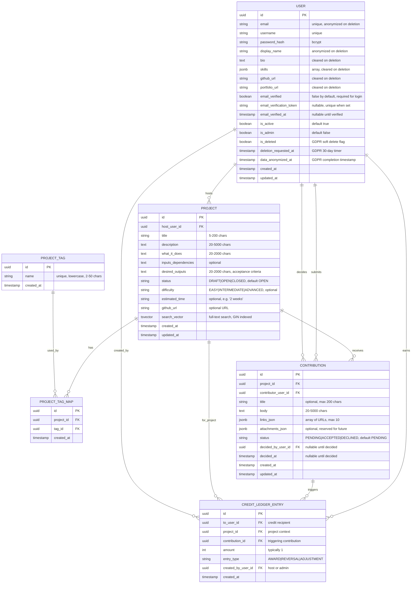

# Data Model Specification
**Feature:** 001-platform-mvp - InterfaceHive Platform MVP
**Created:** 2025-12-29
**Status:** Approved

## Overview

This document defines the complete data model for InterfaceHive MVP, including all entities, relationships, constraints, indexes, and validation rules. The model is designed for PostgreSQL 15+ and implements GDPR compliance, credit transaction integrity, and WCAG-aligned data structures.

---

## Entity Relationship Diagram



---

## Entities

### 1. USER

**Purpose:** Stores user accounts, authentication credentials, profile information, and GDPR compliance data.

**Django Model:**
```python
from django.contrib.auth.models import AbstractUser
from django.db import models
import uuid

class User(AbstractUser):
    # Primary Key
    id = models.UUIDField(primary_key=True, default=uuid.uuid4, editable=False)
    
    # Authentication (overrides AbstractUser fields)
    email = models.EmailField(unique=True, max_length=255)
    username = models.CharField(max_length=150, unique=True)  # Auto-generated from email
    password = models.CharField(max_length=128)  # Django handles hashing
    
    # Email Verification
    email_verified = models.BooleanField(default=False)
    email_verification_token = models.CharField(max_length=64, null=True, blank=True)
    email_verified_at = models.DateTimeField(null=True, blank=True)
    
    # Profile
    display_name = models.CharField(max_length=100)
    bio = models.TextField(max_length=1000, blank=True, default='')
    skills = models.JSONField(default=list, blank=True)  # Array of strings
    github_url = models.URLField(max_length=500, blank=True, default='')
    portfolio_url = models.URLField(max_length=500, blank=True, default='')
    
    # Permissions
    is_active = models.BooleanField(default=True)
    is_admin = models.BooleanField(default=False)
    
    # GDPR Compliance
    is_deleted = models.BooleanField(default=False)
    deletion_requested_at = models.DateTimeField(null=True, blank=True)
    data_anonymized_at = models.DateTimeField(null=True, blank=True)
    
    # Timestamps
    created_at = models.DateTimeField(auto_now_add=True)
    updated_at = models.DateTimeField(auto_now=True)
    
    class Meta:
        db_table = 'users'
        indexes = [
            models.Index(fields=['email'], name='user_email_idx'),
            models.Index(fields=['email_verified'], name='user_email_verified_idx'),
            models.Index(fields=['is_deleted', 'deletion_requested_at'], name='user_gdpr_cleanup_idx'),
            models.Index(fields=['created_at'], name='user_created_at_idx'),
        ]
        constraints = [
            models.CheckConstraint(
                check=models.Q(email_verified=False) | (models.Q(email_verified=True) & models.Q(email_verified_at__isnull=False)),
                name='email_verified_requires_timestamp'
            ),
        ]
    
    def __str__(self):
        return f"{self.display_name} ({self.email})"
    
    def anonymize(self):
        """GDPR anonymization after 30-day retention period"""
        self.email = f"deleted-{self.id}@anonymized.local"
        self.username = f"deleted_{self.id}"
        self.display_name = "Deleted User"
        self.bio = ""
        self.skills = []
        self.github_url = ""
        self.portfolio_url = ""
        self.data_anonymized_at = timezone.now()
        self.is_active = False
        self.save()
```

**Validation Rules:**
- `email`: Valid email format, unique, max 255 chars
- `display_name`: 1-100 chars, required
- `bio`: Max 1000 chars
- `skills`: Array of strings, max 20 items
- `github_url`: Valid URL, max 500 chars
- `portfolio_url`: Valid URL, max 500 chars
- `email_verification_token`: UUID4 format, unique when non-null
- `password`: Min 8 chars, must contain number or special char (validated in serializer)

**State Transitions:**
```
Registration → email_verified=False, email_verification_token set
Verification → email_verified=True, email_verified_at set, token cleared
Login → only allowed if email_verified=True
Deletion Request → is_deleted=True, deletion_requested_at set
Anonymization (30 days) → data_anonymized_at set, PII cleared
```

**Indexes:**
- `email` (unique): Fast login lookup
- `email_verified`: Filter verified users
- `(is_deleted, deletion_requested_at)`: GDPR cleanup query
- `created_at`: User registration timeline

**Constraints:**
- `email` unique
- `username` unique
- `email_verification_token` unique when non-null (partial unique index)
- `email_verified=True` requires `email_verified_at` non-null (check constraint)

---

### 2. PROJECT

**Purpose:** Stores contribution request projects posted by hosts.

**Django Model:**
```python
class Project(models.Model):
    STATUS_CHOICES = [
        ('draft', 'Draft'),
        ('open', 'Open'),
        ('closed', 'Closed'),
    ]
    DIFFICULTY_CHOICES = [
        ('easy', 'Easy'),
        ('intermediate', 'Intermediate'),
        ('advanced', 'Advanced'),
    ]
    
    # Primary Key
    id = models.UUIDField(primary_key=True, default=uuid.uuid4, editable=False)
    
    # Relationships
    host_user = models.ForeignKey(
        User, 
        on_delete=models.CASCADE, 
        related_name='hosted_projects',
        db_index=True
    )
    
    # Content
    title = models.CharField(max_length=200)
    description = models.TextField()
    what_it_does = models.TextField()
    inputs_dependencies = models.TextField(blank=True, default='')
    desired_outputs = models.TextField()
    
    # Metadata
    status = models.CharField(max_length=10, choices=STATUS_CHOICES, default='open')
    difficulty = models.CharField(max_length=15, choices=DIFFICULTY_CHOICES, blank=True, default='')
    estimated_time = models.CharField(max_length=50, blank=True, default='')
    github_url = models.URLField(max_length=500, blank=True, default='')
    
    # Full-Text Search
    search_vector = models.GeneratedField(
        expression=SearchVector('title', weight='A', config='english') + 
                   SearchVector('description', weight='B', config='english'),
        output_field=SearchVectorField(),
        db_persist=True
    )
    
    # Timestamps
    created_at = models.DateTimeField(auto_now_add=True)
    updated_at = models.DateTimeField(auto_now=True)
    
    class Meta:
        db_table = 'projects'
        ordering = ['-created_at']
        indexes = [
            models.Index(fields=['host_user', 'status'], name='project_host_status_idx'),
            models.Index(fields=['status', '-created_at'], name='project_status_created_idx'),
            GinIndex(fields=['search_vector'], name='project_search_idx'),
        ]
    
    def __str__(self):
        return f"{self.title} (by {self.host_user.display_name})"
    
    @property
    def accepted_contributors(self):
        """Returns users with accepted contributions (unique, ordered by acceptance date)"""
        return User.objects.filter(
            contributions__project=self,
            contributions__status='accepted'
        ).distinct().order_by('-contributions__decided_at')
```

**Validation Rules:**
- `title`: 5-200 chars, required
- `description`: 20-5000 chars, required
- `what_it_does`: 20-2000 chars, required
- `desired_outputs`: 20-2000 chars, required (acceptance criteria)
- `inputs_dependencies`: Max 2000 chars, optional
- `status`: One of DRAFT, OPEN, CLOSED
- `difficulty`: One of EASY, INTERMEDIATE, ADVANCED, or empty
- `estimated_time`: Max 50 chars, freeform (e.g., "2 weeks", "1 month")
- `github_url`: Valid URL, max 500 chars

**State Transitions:**
```
Create → status=DRAFT (optional) or OPEN
Publish → DRAFT → OPEN (host only)
Close → OPEN → CLOSED (host only, irreversible)
Edit → allowed only if status != CLOSED (host only)
```

**Indexes:**
- `(host_user, status)`: User's projects filtered by status
- `(status, -created_at)`: Project feed sorted by newest
- `search_vector` (GIN): Full-text keyword search

**Business Rules:**
- Only host can edit/close project
- Contributions accepted only if status=OPEN
- Closing project does not affect existing contributions

---

### 3. PROJECT_TAG

**Purpose:** Stores reusable tags for categorizing projects (skills, technologies).

**Django Model:**
```python
class ProjectTag(models.Model):
    # Primary Key
    id = models.UUIDField(primary_key=True, default=uuid.uuid4, editable=False)
    
    # Data
    name = models.CharField(max_length=50, unique=True)  # Lowercase normalized
    
    # Timestamps
    created_at = models.DateTimeField(auto_now_add=True)
    
    class Meta:
        db_table = 'project_tags'
        ordering = ['name']
    
    def __str__(self):
        return self.name
    
    def save(self, *args, **kwargs):
        self.name = self.name.lower().strip()
        super().save(*args, **kwargs)
```

**Validation Rules:**
- `name`: 2-50 chars, lowercase, alphanumeric + hyphen, unique
- Normalized on save: `name.lower().strip()`

**Business Rules:**
- Tags created on-demand when project submitted with new tag
- Tags never deleted (orphaned tags remain for potential reuse)
- Max 10 tags per project (enforced in serializer)

---

### 4. PROJECT_TAG_MAP

**Purpose:** Many-to-many relationship between projects and tags.

**Django Model:**
```python
class ProjectTagMap(models.Model):
    # Primary Key
    id = models.UUIDField(primary_key=True, default=uuid.uuid4, editable=False)
    
    # Relationships
    project = models.ForeignKey(
        Project, 
        on_delete=models.CASCADE, 
        related_name='tag_maps',
        db_index=True
    )
    tag = models.ForeignKey(
        ProjectTag, 
        on_delete=models.CASCADE, 
        related_name='project_maps',
        db_index=True
    )
    
    # Timestamps
    created_at = models.DateTimeField(auto_now_add=True)
    
    class Meta:
        db_table = 'project_tag_maps'
        unique_together = [['project', 'tag']]
        indexes = [
            models.Index(fields=['project'], name='tagmap_project_idx'),
            models.Index(fields=['tag'], name='tagmap_tag_idx'),
        ]
    
    def __str__(self):
        return f"{self.project.title} → {self.tag.name}"
```

**Constraints:**
- `(project, tag)` unique together (prevents duplicate tags on same project)

**Business Rules:**
- Max 10 tags per project (validated in serializer, not database)
- Tags can be added/removed while project status=DRAFT or OPEN
- Tags immutable for CLOSED projects

---

### 5. CONTRIBUTION

**Purpose:** Stores submissions from contributors to projects.

**Django Model:**
```python
class Contribution(models.Model):
    STATUS_CHOICES = [
        ('pending', 'Pending'),
        ('accepted', 'Accepted'),
        ('declined', 'Declined'),
    ]
    
    # Primary Key
    id = models.UUIDField(primary_key=True, default=uuid.uuid4, editable=False)
    
    # Relationships
    project = models.ForeignKey(
        Project, 
        on_delete=models.CASCADE, 
        related_name='contributions',
        db_index=True
    )
    contributor_user = models.ForeignKey(
        User, 
        on_delete=models.CASCADE, 
        related_name='contributions',
        db_index=True
    )
    decided_by_user = models.ForeignKey(
        User, 
        on_delete=models.SET_NULL, 
        null=True, 
        blank=True, 
        related_name='decisions_made'
    )
    
    # Content
    title = models.CharField(max_length=200, blank=True, default='')
    body = models.TextField()
    links_json = models.JSONField(default=list, blank=True)  # Array of URL strings
    attachments_json = models.JSONField(default=list, blank=True)  # Reserved for future
    
    # Status
    status = models.CharField(max_length=10, choices=STATUS_CHOICES, default='pending')
    decided_at = models.DateTimeField(null=True, blank=True)
    
    # Timestamps
    created_at = models.DateTimeField(auto_now_add=True)
    updated_at = models.DateTimeField(auto_now=True)
    
    class Meta:
        db_table = 'contributions'
        ordering = ['-created_at']
        indexes = [
            models.Index(fields=['project', 'status', '-created_at'], name='contrib_project_status_idx'),
            models.Index(fields=['contributor_user', 'status', '-created_at'], name='contrib_user_status_idx'),
            models.Index(fields=['decided_by_user'], name='contrib_decided_by_idx'),
        ]
        constraints = [
            models.CheckConstraint(
                check=(
                    models.Q(status='pending', decided_by_user__isnull=True, decided_at__isnull=True) |
                    models.Q(status__in=['accepted', 'declined'], decided_by_user__isnull=False, decided_at__isnull=False)
                ),
                name='contribution_decision_consistency'
            ),
        ]
    
    def __str__(self):
        return f"{self.title or 'Contribution'} by {self.contributor_user.display_name} to {self.project.title}"
```

**Validation Rules:**
- `title`: Max 200 chars, optional
- `body`: 20-5000 chars, required
- `links_json`: Array of valid URLs, max 10 items
- `attachments_json`: Reserved for future use (currently empty array)
- `status`: One of PENDING, ACCEPTED, DECLINED

**State Transitions:**
```
Submit → status=PENDING, decided_by=NULL, decided_at=NULL
Accept → status=ACCEPTED, decided_by=host, decided_at=now, credit awarded
Decline → status=DECLINED, decided_by=host, decided_at=now
```

**Indexes:**
- `(project, status, -created_at)`: Project contributions filtered by status
- `(contributor_user, status, -created_at)`: User's contributions by status
- `decided_by_user`: Track moderation activity

**Constraints:**
- `status=PENDING` requires `decided_by=NULL` and `decided_at=NULL`
- `status=ACCEPTED|DECLINED` requires `decided_by!=NULL` and `decided_at!=NULL`

**Business Rules:**
- Only one decision allowed per contribution (no re-opening)
- Only project host or admin can accept/decline
- Contributor cannot submit to own projects (validated in view)
- Submissions only allowed if project status=OPEN

---

### 6. CREDIT_LEDGER_ENTRY

**Purpose:** Append-only ledger tracking credit transactions (awards, reversals).

**Django Model:**
```python
class CreditLedgerEntry(models.Model):
    ENTRY_TYPE_CHOICES = [
        ('award', 'Award'),
        ('reversal', 'Reversal'),
        ('adjustment', 'Adjustment'),
    ]
    
    # Primary Key
    id = models.UUIDField(primary_key=True, default=uuid.uuid4, editable=False)
    
    # Relationships
    to_user = models.ForeignKey(
        User, 
        on_delete=models.CASCADE, 
        related_name='credits_received',
        db_index=True
    )
    project = models.ForeignKey(
        Project, 
        on_delete=models.CASCADE, 
        related_name='credit_ledger',
        db_index=True
    )
    contribution = models.ForeignKey(
        Contribution, 
        on_delete=models.CASCADE, 
        related_name='credit_ledger',
        db_index=True
    )
    created_by_user = models.ForeignKey(
        User, 
        on_delete=models.CASCADE, 
        related_name='credits_issued'
    )
    
    # Transaction Data
    amount = models.IntegerField(default=1)
    entry_type = models.CharField(max_length=15, choices=ENTRY_TYPE_CHOICES, default='award')
    
    # Audit
    created_at = models.DateTimeField(auto_now_add=True)
    
    class Meta:
        db_table = 'credit_ledger_entries'
        ordering = ['-created_at']
        indexes = [
            models.Index(fields=['to_user', '-created_at'], name='ledger_to_user_idx'),
            models.Index(fields=['contribution'], name='ledger_contribution_idx'),
            models.Index(fields=['created_by_user'], name='ledger_created_by_idx'),
        ]
        constraints = [
            models.UniqueConstraint(
                fields=['project', 'to_user'],
                condition=models.Q(entry_type='award'),
                name='unique_award_per_project_user'
            ),
        ]
    
    def __str__(self):
        return f"{self.entry_type.upper()}: {self.amount} credit(s) to {self.to_user.display_name} for {self.project.title}"
    
    def save(self, *args, **kwargs):
        if self.pk:
            raise ValueError("CreditLedgerEntry is append-only. Updates not allowed.")
        super().save(*args, **kwargs)
    
    def delete(self, *args, **kwargs):
        raise ValueError("CreditLedgerEntry is append-only. Deletions not allowed. Use REVERSAL entry type.")
```

**Validation Rules:**
- `amount`: Integer, typically 1 for awards, -1 for reversals
- `entry_type`: One of AWARD, REVERSAL, ADJUSTMENT
- Append-only: `save()` raises exception if `pk` exists
- No deletions: `delete()` raises exception

**Constraints:**
- `(project, to_user)` unique for `entry_type=AWARD` (enforces 1 credit per project/user rule)
- Partial unique constraint allows multiple reversals/adjustments

**Indexes:**
- `(to_user, -created_at)`: User's credit history
- `contribution`: Trace contribution → credit
- `created_by_user`: Admin audit trail

**Business Rules:**
- Entries never updated or deleted (immutability)
- Credit reversals create negative `amount` entries with `entry_type=REVERSAL`
- Total credits = `SUM(amount) WHERE to_user=? AND entry_type='award'`
- Credit awards atomic with contribution acceptance (database transaction)

---

## Computed Fields

### User.total_credits

**Computation:**
```sql
SELECT COUNT(*) 
FROM credit_ledger_entries 
WHERE to_user_id = :user_id 
  AND entry_type = 'award';
```

**Caching:** Not cached. Computed on-demand from ledger (always consistent).

**Performance:** < 20ms with index on `(to_user_id, entry_type)`.

---

### Project.accepted_contributors_count

**Computation:**
```sql
SELECT COUNT(DISTINCT contributor_user_id) 
FROM contributions 
WHERE project_id = :project_id 
  AND status = 'accepted';
```

**Caching:** Cached in Redis with 5-minute TTL, invalidated on contribution acceptance/decline.

**Performance:** < 10ms (indexed query).

---

## Indexes Summary

| Table | Index | Type | Purpose |
|-------|-------|------|---------|
| users | email | B-tree (unique) | Login lookup |
| users | email_verified | B-tree | Filter verified users |
| users | (is_deleted, deletion_requested_at) | B-tree | GDPR cleanup query |
| users | email_verification_token | Partial unique | Token uniqueness |
| projects | (host_user, status) | B-tree | User's projects by status |
| projects | (status, -created_at) | B-tree | Project feed |
| projects | search_vector | GIN | Full-text search |
| project_tags | name | B-tree (unique) | Tag lookup |
| project_tag_maps | (project, tag) | B-tree (unique) | Prevent duplicate tags |
| contributions | (project, status, -created_at) | B-tree | Project contributions |
| contributions | (contributor_user, status, -created_at) | B-tree | User contributions |
| credit_ledger_entries | (to_user, -created_at) | B-tree | User credit history |
| credit_ledger_entries | (project, to_user) where entry_type='award' | Partial unique | 1 credit per project rule |

---

## Migration Strategy

### Initial Migration (0001_initial.py)

1. Create all tables with columns
2. Create non-unique indexes
3. Create unique constraints
4. Create check constraints

### Post-Migration Data Seeding

1. Create admin user (`python manage.py createsuperuser`)
2. Populate common tags (via Django admin or data migration):
   - python, javascript, typescript, react, django, postgresql
   - frontend, backend, fullstack, devops, design, documentation

### GDPR Cleanup Scheduled Task

```python
# tasks.py
from celery import shared_task
from celery.schedules import crontab
from django.utils import timezone
from datetime import timedelta

@shared_task
def anonymize_expired_deletions():
    """Daily task to anonymize users after 30-day retention period"""
    threshold = timezone.now() - timedelta(days=30)
    users_to_anonymize = User.objects.filter(
        is_deleted=True,
        deletion_requested_at__lt=threshold,
        data_anonymized_at__isnull=True
    )
    
    count = 0
    for user in users_to_anonymize:
        user.anonymize()
        count += 1
    
    return f"Anonymized {count} users"

# celerybeat_schedule
from celery.schedules import crontab

CELERYBEAT_SCHEDULE = {
    'anonymize-expired-deletions': {
        'task': 'core.tasks.anonymize_expired_deletions',
        'schedule': crontab(hour=2, minute=0),  # Daily at 2 AM UTC
    },
}
```

---

## Data Integrity Rules

### Foreign Key Cascade Behavior

| Relationship | On Delete | Rationale |
|--------------|-----------|-----------|
| Project.host_user → User | CASCADE | Delete user → delete their projects |
| Contribution.project → Project | CASCADE | Delete project → delete contributions |
| Contribution.contributor_user → User | CASCADE | Delete user → delete their contributions |
| Contribution.decided_by_user → User | SET_NULL | Delete host → preserve decision record |
| CreditLedgerEntry.to_user → User | CASCADE | Delete user → delete credit records |
| CreditLedgerEntry.project → Project | CASCADE | Delete project → delete credit records |
| CreditLedgerEntry.contribution → Contribution | CASCADE | Delete contribution → delete credit record |

**Note:** User deletion uses soft delete (GDPR), so CASCADE rarely triggers.

---

## Security Considerations

### SQL Injection Prevention

- All queries use Django ORM (parameterized queries)
- No raw SQL in application code
- Full-text search uses `SearchQuery` (auto-escaped)

### Data Sanitization

- User input sanitized via DRF serializers
- URLs validated with `URLValidator`
- JSON fields validated for structure (arrays, max length)
- Markdown rendering (future) uses `bleach` for XSS prevention

### Audit Logging

- All credit transactions logged with `created_by_user`
- Contribution decisions logged with `decided_by_user` and `decided_at`
- User anonymization logged in application logs

---

## Performance Optimization

### Query Optimization

1. **N+1 Prevention:**
   - Project list: `select_related('host_user')`
   - Project detail: `prefetch_related('tag_maps__tag', 'contributions__contributor_user')`
   - Contribution list: `select_related('contributor_user', 'decided_by_user')`

2. **Pagination:**
   - Default page size: 20
   - Max page size: 100
   - Cursor pagination for infinite scroll (future)

3. **Full-Text Search:**
   - GIN index on `search_vector`
   - Search queries: < 100ms for 100K projects

4. **Credit Balance:**
   - Aggregate query with index: < 20ms

### Database Connection Pooling

- pgBouncer in transaction mode
- Pool size: 20 connections
- Max clients: 500 concurrent users

---

## Testing Strategy

### Model Tests

```python
# tests/test_models.py

def test_user_anonymize():
    user = UserFactory(email='test@example.com', display_name='Test User')
    user.anonymize()
    assert user.email.startswith('deleted-')
    assert user.display_name == 'Deleted User'
    assert user.bio == ''

def test_credit_ledger_immutable():
    entry = CreditLedgerEntryFactory()
    entry.amount = 2
    with pytest.raises(ValueError, match="append-only"):
        entry.save()

def test_unique_award_constraint():
    project = ProjectFactory()
    user = UserFactory()
    CreditLedgerEntryFactory(project=project, to_user=user, entry_type='award')
    with pytest.raises(IntegrityError):
        CreditLedgerEntryFactory(project=project, to_user=user, entry_type='award')
```

---

## Appendix: SQL Schema

### PostgreSQL Schema (Generated by Django)

```sql
-- Users Table
CREATE TABLE users (
    id UUID PRIMARY KEY DEFAULT gen_random_uuid(),
    email VARCHAR(255) UNIQUE NOT NULL,
    username VARCHAR(150) UNIQUE NOT NULL,
    password VARCHAR(128) NOT NULL,
    display_name VARCHAR(100) NOT NULL,
    bio TEXT DEFAULT '',
    skills JSONB DEFAULT '[]',
    github_url VARCHAR(500) DEFAULT '',
    portfolio_url VARCHAR(500) DEFAULT '',
    email_verified BOOLEAN DEFAULT FALSE,
    email_verification_token VARCHAR(64),
    email_verified_at TIMESTAMP,
    is_active BOOLEAN DEFAULT TRUE,
    is_admin BOOLEAN DEFAULT FALSE,
    is_deleted BOOLEAN DEFAULT FALSE,
    deletion_requested_at TIMESTAMP,
    data_anonymized_at TIMESTAMP,
    created_at TIMESTAMP DEFAULT CURRENT_TIMESTAMP,
    updated_at TIMESTAMP DEFAULT CURRENT_TIMESTAMP
);

CREATE INDEX user_email_idx ON users (email);
CREATE INDEX user_email_verified_idx ON users (email_verified);
CREATE INDEX user_gdpr_cleanup_idx ON users (is_deleted, deletion_requested_at);
CREATE UNIQUE INDEX user_verification_token_idx ON users (email_verification_token) WHERE email_verification_token IS NOT NULL;

-- Projects Table
CREATE TABLE projects (
    id UUID PRIMARY KEY DEFAULT gen_random_uuid(),
    host_user_id UUID NOT NULL REFERENCES users(id) ON DELETE CASCADE,
    title VARCHAR(200) NOT NULL,
    description TEXT NOT NULL,
    what_it_does TEXT NOT NULL,
    inputs_dependencies TEXT DEFAULT '',
    desired_outputs TEXT NOT NULL,
    status VARCHAR(10) DEFAULT 'open',
    difficulty VARCHAR(15) DEFAULT '',
    estimated_time VARCHAR(50) DEFAULT '',
    github_url VARCHAR(500) DEFAULT '',
    search_vector TSVECTOR GENERATED ALWAYS AS (
        setweight(to_tsvector('english', title), 'A') || 
        setweight(to_tsvector('english', description), 'B')
    ) STORED,
    created_at TIMESTAMP DEFAULT CURRENT_TIMESTAMP,
    updated_at TIMESTAMP DEFAULT CURRENT_TIMESTAMP
);

CREATE INDEX project_host_status_idx ON projects (host_user_id, status);
CREATE INDEX project_status_created_idx ON projects (status, created_at DESC);
CREATE INDEX project_search_idx ON projects USING GIN (search_vector);

-- Project Tags Table
CREATE TABLE project_tags (
    id UUID PRIMARY KEY DEFAULT gen_random_uuid(),
    name VARCHAR(50) UNIQUE NOT NULL,
    created_at TIMESTAMP DEFAULT CURRENT_TIMESTAMP
);

-- Project Tag Maps Table
CREATE TABLE project_tag_maps (
    id UUID PRIMARY KEY DEFAULT gen_random_uuid(),
    project_id UUID NOT NULL REFERENCES projects(id) ON DELETE CASCADE,
    tag_id UUID NOT NULL REFERENCES project_tags(id) ON DELETE CASCADE,
    created_at TIMESTAMP DEFAULT CURRENT_TIMESTAMP,
    UNIQUE (project_id, tag_id)
);

CREATE INDEX tagmap_project_idx ON project_tag_maps (project_id);
CREATE INDEX tagmap_tag_idx ON project_tag_maps (tag_id);

-- Contributions Table
CREATE TABLE contributions (
    id UUID PRIMARY KEY DEFAULT gen_random_uuid(),
    project_id UUID NOT NULL REFERENCES projects(id) ON DELETE CASCADE,
    contributor_user_id UUID NOT NULL REFERENCES users(id) ON DELETE CASCADE,
    decided_by_user_id UUID REFERENCES users(id) ON DELETE SET NULL,
    title VARCHAR(200) DEFAULT '',
    body TEXT NOT NULL,
    links_json JSONB DEFAULT '[]',
    attachments_json JSONB DEFAULT '[]',
    status VARCHAR(10) DEFAULT 'pending',
    decided_at TIMESTAMP,
    created_at TIMESTAMP DEFAULT CURRENT_TIMESTAMP,
    updated_at TIMESTAMP DEFAULT CURRENT_TIMESTAMP,
    CONSTRAINT contribution_decision_consistency CHECK (
        (status = 'pending' AND decided_by_user_id IS NULL AND decided_at IS NULL) OR
        (status IN ('accepted', 'declined') AND decided_by_user_id IS NOT NULL AND decided_at IS NOT NULL)
    )
);

CREATE INDEX contrib_project_status_idx ON contributions (project_id, status, created_at DESC);
CREATE INDEX contrib_user_status_idx ON contributions (contributor_user_id, status, created_at DESC);
CREATE INDEX contrib_decided_by_idx ON contributions (decided_by_user_id);

-- Credit Ledger Entries Table
CREATE TABLE credit_ledger_entries (
    id UUID PRIMARY KEY DEFAULT gen_random_uuid(),
    to_user_id UUID NOT NULL REFERENCES users(id) ON DELETE CASCADE,
    project_id UUID NOT NULL REFERENCES projects(id) ON DELETE CASCADE,
    contribution_id UUID NOT NULL REFERENCES contributions(id) ON DELETE CASCADE,
    created_by_user_id UUID NOT NULL REFERENCES users(id) ON DELETE CASCADE,
    amount INTEGER DEFAULT 1,
    entry_type VARCHAR(15) DEFAULT 'award',
    created_at TIMESTAMP DEFAULT CURRENT_TIMESTAMP
);

CREATE INDEX ledger_to_user_idx ON credit_ledger_entries (to_user_id, created_at DESC);
CREATE INDEX ledger_contribution_idx ON credit_ledger_entries (contribution_id);
CREATE INDEX ledger_created_by_idx ON credit_ledger_entries (created_by_user_id);
CREATE UNIQUE INDEX unique_award_per_project_user ON credit_ledger_entries (project_id, to_user_id) WHERE entry_type = 'award';
```

---

**Status:** Data model complete and ready for implementation.
**Next Steps:** Generate OpenAPI contract in `contracts/openapi.yaml`.
