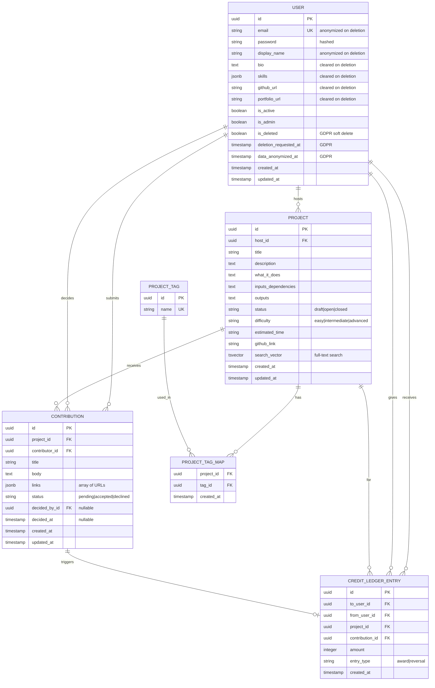

# Data Model Specification: InterfaceHive Platform MVP

**Version:** 1.0
**Date:** 2025-12-22
**Database:** PostgreSQL 15+

## Overview

This document defines the complete data model for InterfaceHive, including entities, relationships, constraints, indexes, and migration strategy. The model supports GDPR compliance, credit integrity, and performance at scale (10K users, 500 concurrent).

## Entity Relationship Diagram



## Entity Definitions

### 1. User

**Purpose:** Represents all platform users (hosts, contributors, admins).

**Django Model:**
```python
from django.contrib.auth.models import AbstractUser
from django.db import models
import uuid

class User(AbstractUser):
    """
    User model with GDPR compliance fields.
    Extends Django's AbstractUser for authentication.
    """
    id = models.UUIDField(
        primary_key=True,
        default=uuid.uuid4,
        editable=False
    )
    email = models.EmailField(
        unique=True,
        db_index=True,
        help_text="Anonymized to 'deleted-{uuid}@anonymized.local' on deletion"
    )
    # username inherited from AbstractUser (required for Django auth)
    password = models.CharField(
        max_length=128,
        help_text="PBKDF2 hashed password"
    )
    display_name = models.CharField(
        max_length=100,
        help_text="Anonymized to 'Deleted User' on deletion"
    )
    bio = models.TextField(
        blank=True,
        help_text="Cleared on deletion"
    )
    skills = models.JSONField(
        default=list,
        blank=True,
        help_text="Array of skill strings, cleared on deletion"
    )
    github_url = models.URLField(
        blank=True,
        help_text="Cleared on deletion"
    )
    portfolio_url = models.URLField(
        blank=True,
        help_text="Cleared on deletion"
    )
    is_active = models.BooleanField(
        default=True,
        help_text="False if user is banned or deactivated"
    )
    is_admin = models.BooleanField(
        default=False,
        help_text="Admin users can moderate content and reverse credits"
    )
    
    # GDPR Compliance Fields
    is_deleted = models.BooleanField(
        default=False,
        db_index=True,
        help_text="Soft deletion flag for GDPR compliance"
    )
    deletion_requested_at = models.DateTimeField(
        null=True,
        blank=True,
        help_text="Timestamp when user requested account deletion"
    )
    data_anonymized_at = models.DateTimeField(
        null=True,
        blank=True,
        help_text="Timestamp when user data was anonymized"
    )
    
    created_at = models.DateTimeField(auto_now_add=True)
    updated_at = models.DateTimeField(auto_now=True)
    
    class Meta:
        db_table = 'users'
        indexes = [
            models.Index(fields=['email'], name='idx_user_email'),
            models.Index(fields=['is_deleted', 'deletion_requested_at'], name='idx_user_deletion'),
            models.Index(fields=['created_at'], name='idx_user_created'),
        ]
    
    def __str__(self):
        return self.display_name if not self.is_deleted else "Deleted User"
    
    @property
    def credit_balance(self):
        """Compute credit balance from ledger entries."""
        from .credit_ledger_entry import CreditLedgerEntry
        return CreditLedgerEntry.objects.filter(
            to_user=self,
            entry_type='award'
        ).count()
```

**Validation Rules:**
- `email`: Must be valid email format, unique across platform
- `password`: Minimum 8 characters (enforced in serializer/form)
- `display_name`: Required, 1-100 characters
- `bio`: Max 5000 characters
- `skills`: Array of strings, max 20 items
- `github_url`, `portfolio_url`: Valid URL format

**State Transitions:**
- Active → Deletion Requested: User initiates deletion
- Deletion Requested → Anonymized: 30 days after deletion_requested_at
- Active → Banned: Admin sets is_active=False

**Anonymization Logic:**
```python
def anonymize_user(user):
    """Anonymize user data while preserving audit trail."""
    user.email = f"deleted-{user.id}@anonymized.local"
    user.display_name = "Deleted User"
    user.bio = ""
    user.skills = []
    user.github_url = ""
    user.portfolio_url = ""
    user.data_anonymized_at = timezone.now()
    user.save()
```

---

### 2. Project

**Purpose:** Represents contribution requests posted by hosts.

**Django Model:**
```python
from django.db import models
from django.contrib.postgres.search import SearchVectorField
from django.contrib.postgres.indexes import GinIndex
import uuid

class Project(models.Model):
    """
    Project (Call for Contribution) model.
    Supports full-text search via PostgreSQL GIN index.
    """
    STATUS_CHOICES = [
        ('draft', 'Draft'),
        ('open', 'Open'),
        ('closed', 'Closed'),
    ]
    DIFFICULTY_CHOICES = [
        ('easy', 'Easy'),
        ('intermediate', 'Intermediate'),
        ('advanced', 'Advanced'),
    ]
    
    id = models.UUIDField(primary_key=True, default=uuid.uuid4, editable=False)
    host = models.ForeignKey(
        'User',
        on_delete=models.CASCADE,
        related_name='hosted_projects',
        help_text="User who created the project"
    )
    title = models.CharField(
        max_length=200,
        help_text="Project title (5-200 chars)"
    )
    description = models.TextField(
        help_text="Detailed project description (20-5000 chars)"
    )
    what_it_does = models.TextField(
        help_text="Explanation of project purpose (20-2000 chars)"
    )
    inputs_dependencies = models.TextField(
        blank=True,
        help_text="Optional: prerequisites, dependencies"
    )
    outputs = models.TextField(
        help_text="Acceptance criteria / desired outputs (20-2000 chars)"
    )
    status = models.CharField(
        max_length=10,
        choices=STATUS_CHOICES,
        default='open',
        db_index=True
    )
    difficulty = models.CharField(
        max_length=15,
        choices=DIFFICULTY_CHOICES,
        blank=True
    )
    estimated_time = models.CharField(
        max_length=50,
        blank=True,
        help_text="e.g., '2 weeks', '40 hours'"
    )
    github_link = models.URLField(blank=True)
    
    # Full-text search
    search_vector = SearchVectorField(null=True)
    
    created_at = models.DateTimeField(auto_now_add=True, db_index=True)
    updated_at = models.DateTimeField(auto_now=True)
    
    class Meta:
        db_table = 'projects'
        indexes = [
            models.Index(fields=['host', 'status'], name='idx_project_host_status'),
            models.Index(fields=['status', '-created_at'], name='idx_project_status_created'),
            GinIndex(fields=['search_vector'], name='idx_project_search'),
        ]
        ordering = ['-created_at']
    
    def __str__(self):
        return self.title
    
    @property
    def accepted_contributors_count(self):
        """Count unique accepted contributors."""
        return self.contributions.filter(status='accepted').values('contributor').distinct().count()
```

**Validation Rules:**
- `title`: 5-200 characters
- `description`: 20-5000 characters
- `what_it_does`: 20-2000 characters
- `outputs`: 20-2000 characters (required)
- `status`: Must be one of: draft, open, closed
- `difficulty`: Optional, one of: easy, intermediate, advanced
- `github_link`: Valid URL if provided

**State Transitions:**
- Draft → Open: Host publishes project
- Open → Closed: Host closes project (no longer accepting contributions)
- Closed cannot transition back to Open (business rule)

**Full-Text Search Setup:**
```sql
-- Trigger to update search_vector
CREATE TRIGGER project_search_vector_update
BEFORE INSERT OR UPDATE ON projects
FOR EACH ROW EXECUTE FUNCTION
tsvector_update_trigger(search_vector, 'pg_catalog.english', title, description, what_it_does);
```

---

### 3. ProjectTag

**Purpose:** Normalized tags for categorizing projects (skills, tech stack).

**Django Model:**
```python
class ProjectTag(models.Model):
    """
    Normalized tags for project categorization.
    Examples: 'python', 'react', 'machine-learning', 'frontend'
    """
    id = models.UUIDField(primary_key=True, default=uuid.uuid4, editable=False)
    name = models.CharField(
        max_length=50,
        unique=True,
        db_index=True,
        help_text="Lowercase, hyphenated tag name"
    )
    
    class Meta:
        db_table = 'project_tags'
    
    def __str__(self):
        return self.name
    
    def save(self, *args, **kwargs):
        self.name = self.name.lower().replace(' ', '-')
        super().save(*args, **kwargs)
```

**Validation Rules:**
- `name`: 1-50 characters, unique, auto-lowercased and hyphenated

---

### 4. ProjectTagMap

**Purpose:** Many-to-many relationship between projects and tags.

**Django Model:**
```python
class ProjectTagMap(models.Model):
    """
    Junction table for Project <-> ProjectTag many-to-many relationship.
    """
    project = models.ForeignKey(
        'Project',
        on_delete=models.CASCADE,
        related_name='tag_maps'
    )
    tag = models.ForeignKey(
        'ProjectTag',
        on_delete=models.CASCADE,
        related_name='project_maps'
    )
    created_at = models.DateTimeField(auto_now_add=True)
    
    class Meta:
        db_table = 'project_tag_maps'
        unique_together = [['project', 'tag']]
        indexes = [
            models.Index(fields=['project'], name='idx_tagmap_project'),
            models.Index(fields=['tag'], name='idx_tagmap_tag'),
        ]
    
    def __str__(self):
        return f"{self.project.title} - {self.tag.name}"
```

**Constraints:**
- Unique constraint on (project_id, tag_id) prevents duplicate tags on same project
- Max 10 tags per project (enforced in serializer)

---

### 5. Contribution

**Purpose:** Represents work submitted by contributors to projects.

**Django Model:**
```python
class Contribution(models.Model):
    """
    Contribution (submission) model.
    Tracks status and decision metadata.
    """
    STATUS_CHOICES = [
        ('pending', 'Pending'),
        ('accepted', 'Accepted'),
        ('declined', 'Declined'),
    ]
    
    id = models.UUIDField(primary_key=True, default=uuid.uuid4, editable=False)
    project = models.ForeignKey(
        'Project',
        on_delete=models.CASCADE,
        related_name='contributions'
    )
    contributor = models.ForeignKey(
        'User',
        on_delete=models.CASCADE,
        related_name='contributions'
    )
    title = models.CharField(
        max_length=200,
        blank=True,
        help_text="Optional submission title"
    )
    body = models.TextField(
        help_text="Contribution description/explanation (20-5000 chars)"
    )
    links = models.JSONField(
        default=list,
        blank=True,
        help_text="Array of URLs (GitHub PR, Figma, docs), max 10"
    )
    status = models.CharField(
        max_length=10,
        choices=STATUS_CHOICES,
        default='pending',
        db_index=True
    )
    decided_by = models.ForeignKey(
        'User',
        on_delete=models.SET_NULL,
        null=True,
        blank=True,
        related_name='decisions_made',
        help_text="User who accepted/declined (host or admin)"
    )
    decided_at = models.DateTimeField(
        null=True,
        blank=True,
        help_text="Timestamp when decision was made"
    )
    created_at = models.DateTimeField(auto_now_add=True, db_index=True)
    updated_at = models.DateTimeField(auto_now=True)
    
    class Meta:
        db_table = 'contributions'
        indexes = [
            models.Index(fields=['project', 'status', '-created_at'], name='idx_contrib_project_status'),
            models.Index(fields=['contributor', 'status', '-created_at'], name='idx_contrib_contributor_status'),
        ]
        ordering = ['-created_at']
        constraints = [
            models.CheckConstraint(
                check=(
                    (models.Q(status='pending') & models.Q(decided_by__isnull=True) & models.Q(decided_at__isnull=True)) |
                    (models.Q(status__in=['accepted', 'declined']) & models.Q(decided_by__isnull=False) & models.Q(decided_at__isnull=False))
                ),
                name='check_decision_consistency'
            )
        ]
    
    def __str__(self):
        return f"{self.contributor.display_name} → {self.project.title} [{self.status}]"
```

**Validation Rules:**
- `body`: 20-5000 characters (required)
- `links`: Array of valid URLs, max 10 items
- `status`: Must be one of: pending, accepted, declined
- **Decision Consistency:** If status is accepted/declined, `decided_by` and `decided_at` must be non-null

**State Transitions:**
- Pending → Accepted: Host accepts contribution (awards credit)
- Pending → Declined: Host declines contribution (no credit)
- Accepted/Declined cannot transition to other states (immutable after decision)

---

### 6. CreditLedgerEntry

**Purpose:** Append-only ledger tracking all credit transactions.

**Django Model:**
```python
class CreditLedgerEntry(models.Model):
    """
    Append-only credit ledger for audit trail and fraud prevention.
    Enforces 1 credit per user per project via unique constraint.
    """
    ENTRY_TYPE_CHOICES = [
        ('award', 'Award'),
        ('reversal', 'Reversal'),
    ]
    
    id = models.UUIDField(primary_key=True, default=uuid.uuid4, editable=False)
    to_user = models.ForeignKey(
        'User',
        on_delete=models.CASCADE,
        related_name='credits_received',
        help_text="User receiving the credit"
    )
    from_user = models.ForeignKey(
        'User',
        on_delete=models.CASCADE,
        related_name='credits_given',
        help_text="User giving the credit (project host)"
    )
    project = models.ForeignKey(
        'Project',
        on_delete=models.CASCADE,
        related_name='credit_entries'
    )
    contribution = models.ForeignKey(
        'Contribution',
        on_delete=models.CASCADE,
        related_name='credit_entries'
    )
    amount = models.IntegerField(
        default=1,
        help_text="Typically 1 for award, -1 for reversal"
    )
    entry_type = models.CharField(
        max_length=10,
        choices=ENTRY_TYPE_CHOICES,
        default='award'
    )
    created_at = models.DateTimeField(auto_now_add=True, db_index=True)
    
    class Meta:
        db_table = 'credit_ledger_entries'
        indexes = [
            models.Index(fields=['to_user', '-created_at'], name='idx_credit_to_user'),
            models.Index(fields=['contribution'], name='idx_credit_contribution'),
        ]
        constraints = [
            models.UniqueConstraint(
                fields=['project', 'to_user'],
                condition=models.Q(entry_type='award'),
                name='unique_award_per_project_user'
            )
        ]
    
    def __str__(self):
        return f"{self.from_user.display_name} → {self.to_user.display_name} [{self.entry_type}] {self.amount}"
```

**Validation Rules:**
- `amount`: Must be positive for awards, negative for reversals
- `entry_type`: Must be one of: award, reversal
- **Unique Award:** Only one 'award' entry per (project, to_user) combination

**Business Rules:**
1. **Append-Only:** Never UPDATE or DELETE entries (immutable audit trail)
2. **Atomic Award:** Credit award must be in transaction with contribution status update
3. **Reversal Process:** Admin creates reversal entry (negative amount), original entry remains
4. **Credit Balance:** Sum of all entries for a user: `SUM(amount) WHERE to_user=user`

**Atomic Accept Workflow:**
```python
from django.db import transaction

@transaction.atomic
def accept_contribution(contribution_id, host_user):
    contribution = Contribution.objects.select_for_update().get(id=contribution_id)
    
    # Verify host permission
    if contribution.project.host != host_user and not host_user.is_admin:
        raise PermissionDenied("Only host can accept contributions")
    
    # Verify pending status
    if contribution.status != 'pending':
        raise ValidationError("Contribution already decided")
    
    # Update contribution status
    contribution.status = 'accepted'
    contribution.decided_by = host_user
    contribution.decided_at = timezone.now()
    contribution.save()
    
    # Award credit (unique constraint prevents duplicate)
    try:
        CreditLedgerEntry.objects.create(
            to_user=contribution.contributor,
            from_user=contribution.project.host,
            project=contribution.project,
            contribution=contribution,
            amount=1,
            entry_type='award'
        )
        credit_awarded = True
    except IntegrityError:
        # User already has credit for this project
        credit_awarded = False
    
    return contribution, credit_awarded
```

---

## Indexes & Performance

### Index Strategy

**User Table:**
- Primary key: `id` (UUID, clustered index)
- Unique index: `email`
- Composite index: `(is_deleted, deletion_requested_at)` for GDPR cleanup job
- Index: `created_at` for analytics

**Project Table:**
- Primary key: `id` (UUID)
- Composite index: `(host_id, status)` for "my projects" queries
- Composite index: `(status, created_at DESC)` for project list filtering
- GIN index: `search_vector` for full-text search

**Contribution Table:**
- Primary key: `id` (UUID)
- Composite index: `(project_id, status, created_at DESC)` for project contributions list
- Composite index: `(contributor_id, status, created_at DESC)` for "my contributions" queries

**CreditLedgerEntry Table:**
- Primary key: `id` (UUID)
- Composite index: `(to_user_id, created_at DESC)` for credit history
- Index: `contribution_id` for contribution-ledger relationship
- Partial unique index: `(project_id, to_user_id) WHERE entry_type='AWARD'` for business rule

**ProjectTagMap Table:**
- Composite unique index: `(project_id, tag_id)`
- Index: `project_id` for tag lookups
- Index: `tag_id` for projects-by-tag queries

### Query Optimization Examples

**Project List with Tags (N+1 Prevention):**
```python
projects = Project.objects.filter(status='open').prefetch_related('tag_maps__tag')[:20]
```

**Project Detail with Accepted Contributors:**
```python
project = Project.objects.select_related('host').prefetch_related(
    models.Prefetch(
        'contributions',
        queryset=Contribution.objects.filter(status='accepted').select_related('contributor')
    )
).get(id=project_id)
```

**User Credit Balance:**
```python
balance = CreditLedgerEntry.objects.filter(to_user=user, entry_type='award').count()
```

---

## Migration Strategy

### Phase 1: Initial Schema (Migration 0001)
1. Create User, Project, ProjectTag, ProjectTagMap, Contribution, CreditLedgerEntry tables
2. Create all indexes (except GIN for full-text search)
3. Create unique constraints and check constraints

### Phase 2: Full-Text Search (Migration 0002)
1. Add `search_vector` column to Project table
2. Create GIN index on `search_vector`
3. Create trigger to update `search_vector` on INSERT/UPDATE

### Phase 3: Seed Data (Data Migration 0003)
1. Populate ProjectTag table with common tags:
   - Frontend: `react`, `vue`, `angular`, `svelte`, `typescript`, `javascript`, `css`, `html`
   - Backend: `python`, `django`, `nodejs`, `express`, `fastapi`, `ruby`, `rails`, `php`
   - Mobile: `react-native`, `flutter`, `ios`, `android`, `swift`, `kotlin`
   - Data: `postgresql`, `mysql`, `mongodb`, `redis`, `elasticsearch`
   - DevOps: `docker`, `kubernetes`, `ci-cd`, `aws`, `gcp`, `azure`
   - Design: `figma`, `ui-ux`, `design-system`, `accessibility`
   - Other: `machine-learning`, `data-science`, `testing`, `documentation`, `security`

### Phase 4: GDPR Compliance (Migration 0004)
- Already included in initial schema (User model has GDPR fields)
- Create Celery periodic task for data anonymization

### Rollback Strategy
- Each migration has a `reverse()` method for safe rollback
- Test all migrations in staging before production deployment
- Backup database before running migrations in production

---

## GDPR Data Anonymization

### Scheduled Job (Celery Beat)

```python
from celery import shared_task
from django.utils import timezone
from datetime import timedelta

@shared_task
def anonymize_deleted_users():
    """
    Anonymize user data 30 days after deletion request.
    Runs daily via Celery Beat.
    """
    thirty_days_ago = timezone.now() - timedelta(days=30)
    users_to_anonymize = User.objects.filter(
        is_deleted=True,
        deletion_requested_at__lte=thirty_days_ago,
        data_anonymized_at__isnull=True
    )
    
    for user in users_to_anonymize:
        user.email = f"deleted-{user.id}@anonymized.local"
        user.display_name = "Deleted User"
        user.bio = ""
        user.skills = []
        user.github_url = ""
        user.portfolio_url = ""
        user.data_anonymized_at = timezone.now()
        user.save()
    
    return f"Anonymized {users_to_anonymize.count()} users"
```

### Celery Beat Schedule

```python
# settings.py
CELERY_BEAT_SCHEDULE = {
    'anonymize-deleted-users-daily': {
        'task': 'apps.users.tasks.anonymize_deleted_users',
        'schedule': crontab(hour=2, minute=0),  # Run at 2 AM daily
    },
}
```

---

## Summary

- **6 Core Tables:** User, Project, ProjectTag, ProjectTagMap, Contribution, CreditLedgerEntry
- **GDPR Compliant:** Soft deletion + 30-day anonymization preserves audit trail
- **Credit Integrity:** Append-only ledger + unique constraint prevents fraud
- **Performance:** Strategic indexes for < 3s query times at scale (10K users)
- **Scalability:** PostgreSQL supports horizontal scaling via read replicas
- **Auditability:** All decisions and credit transactions timestamped and immutable

---

## References
- Django ORM Documentation: https://docs.djangoproject.com/en/stable/ref/models/
- PostgreSQL Full-Text Search: https://www.postgresql.org/docs/current/textsearch.html
- GDPR Right to Erasure: https://gdpr-info.eu/art-17-gdpr/
- Celery Beat Scheduling: https://docs.celeryq.dev/en/stable/userguide/periodic-tasks.html

